Todo sistema começa pequeno. Uma instância, um banco, algumas dezenas de usuários simultâneos. Funciona bem, os tempos de resposta são ótimos, e ninguém pensa em "escala" porque não precisa.

Aí o produto cresce. O time sobe o tamanho da máquina uma vez, duas vezes, e na terceira descobre que já está na maior instância que o provedor de nuvem oferece. Ou pior: a máquina aguenta, mas um deploy de rotina derruba o serviço inteiro por três minutos porque só existe uma instância rodando. Ou o banco aguenta escrita, mas os relatórios de fim de mês travam tudo porque disputam os mesmos recursos das transações de produção.

Esses três problemas têm nomes diferentes: limite de escala vertical, ponto único de falha, contenção de recursos. Mas a raiz é a mesma. O sistema foi desenhado para um volume de carga e uma tolerância a falha que já não correspondem à realidade.

Este post cobre como pensar esse problema de forma estruturada. Primeiro a teoria: escala vertical vs horizontal, alta disponibilidade, multi-AZ, multi-region, e como isso se aplica à aplicação, ao banco relacional, ao cache e ao NoSQL. Depois um laboratório prático com Spring Boot, Java 25, Postgres, Cassandra, Redis, Kafka, Kubernetes e AWS.

## Conteúdo

- [Escala vertical vs horizontal](#vertical-vs-horizontal)
- [Alta disponibilidade: o que isso significa de verdade](#alta-disponibilidade)
- [Multi-AZ: redundância dentro da mesma região](#multi-az)
- [Multi-region: quando uma região inteira não é suficiente](#multi-region)
- [Escalando a camada de aplicação](#escalando-a-aplicacao)
- [Escalando o banco relacional](#escalando-postgres)
- [Cache distribuído](#cache-distribuido)
- [NoSQL para escala horizontal](#nosql-para-escala)
- [Mensageria e desacoplamento](#mensageria-desacoplamento)
- [Na prática: arquitetura do laboratório](#arquitetura-do-laboratorio)
- [App base: Spring Boot e Java 25](#app-spring-boot-java-25)
- [Postgres com réplica de leitura](#postgres-na-pratica)
- [Cassandra em cluster](#cassandra-na-pratica)
- [Redis como cache distribuído](#redis-na-pratica)
- [Kafka para desacoplar processamento](#kafka-na-pratica)
- [Kubernetes: escalando os pods da aplicação](#kubernetes-escalando-pods)
- [AWS: multi-AZ e multi-region na prática](#aws-multi-az-multi-region)
- [Testando a escala](#testando-a-escala)
- [Considerações finais](#consideracoes-finais)
- [Referências](#referencias)

## <a name="vertical-vs-horizontal">Escala vertical vs horizontal</a>

Escala vertical é aumentar a máquina: mais CPU, mais memória, disco mais rápido. É a primeira coisa que qualquer time faz, porque é simples. Não muda uma linha de código, não introduz complexidade distribuída, só troca o tipo da instância e reinicia.

O problema é que tem teto. Existe um tamanho máximo de instância no provedor de nuvem. E mesmo antes de chegar nele, o custo cresce de forma desproporcional ao ganho: dobrar de 8 para 16 vCPUs não costuma custar o dobro, custa bem mais que o dobro. O ganho real também depende de o aplicativo conseguir usar esses recursos extras, o que nem sempre acontece se o gargalo é entrada e saída de dados (I/O), não CPU.

Escala horizontal é diferente: em vez de uma máquina maior, várias máquinas menores rodando a mesma coisa, com um balanceador de carga na frente distribuindo requisições entre elas.

```goat
                 +----------------+
   requisição -->| Load Balancer  |
                 +----------------+
                   /       |       \
                  v        v        v
             +-----+   +-----+   +-----+
             | app |   | app |   | app |
             |  1  |   |  2  |   |  3  |
             +-----+   +-----+   +-----+
```

A vantagem não é só capacidade. Se a instância 2 cair, o load balancer para de mandar tráfego para ela e o serviço continua no ar com as outras duas. Isso já é meio caminho andado para alta disponibilidade, e chegamos lá na próxima seção.

O preço da escala horizontal é complexidade. A aplicação precisa ser **stateless**, ou seja, sem estado: nenhuma instância pode guardar algo que só ela conhece, como sessão de usuário na memória local, arquivo gravado em disco local ou cache que não é compartilhado. Isso quebra porque a próxima requisição do mesmo usuário pode cair em qualquer uma das instâncias. Resolver isso significa mover sessão para um cache compartilhado, arquivo para um storage compartilhado, e aceitar que a aplicação não controla mais em qual máquina física ela está rodando.

Na prática, a maioria dos sistemas usa os dois. Escala vertical até um ponto razoável, a instância boa o bastante para o perfil de carga, depois escala horizontal a partir dali. Não é uma escolha binária.

## <a name="alta-disponibilidade">Alta disponibilidade: o que isso significa de verdade</a>

Alta disponibilidade, ou HA, é frequentemente resumida em "número de noves": 99.9% de disponibilidade permite cerca de 8h45min de indisponibilidade por ano, 99.99% permite pouco mais de 52 minutos, e 99.999%, o famoso "five nines" (cinco noves), permite cerca de 5 minutos. Números bonitos, mas que escondem a pergunta que importa: indisponibilidade de **o quê**, exatamente?

Um SLA (o acordo de nível de serviço firmado com o cliente) só faz sentido quando está atrelado a um objetivo de serviço claro, o SLO, medido de um jeito específico: percentual de requisições HTTP bem-sucedidas num intervalo, latência do percentil 99 abaixo de um limite, health check respondendo dentro de um timeout. Sem essa definição, "99.9% de disponibilidade" é uma frase de marketing, não uma meta técnica.

O conceito central por trás de HA é o **SPOF**, sigla para _single point of failure_, ponto único de falha: qualquer componente cuja falha sozinha derruba o sistema inteiro. Uma única instância de aplicação é um SPOF óbvio. Um único banco de dados também é, mesmo que a aplicação tenha dez instâncias. Um único load balancer na frente de tudo é um SPOF que muita gente esquece de considerar.

Eliminar um SPOF sempre segue o mesmo padrão: redundância mais um mecanismo de detectar falha e redirecionar o tráfego.

```goat
+--------+     +--------------+     +---------+
| Client |---->| Balanceador  |---->| app (1) |  saudável
+--------+     +--------------+     +---------+
                      |
                      |  health check falhou
                      v
                 +---------+
                 | app (2) |  removido do pool
                 +---------+
```

O balanceador, ou o orquestrador no caso do Kubernetes, faz **health checks** periódicos: uma chamada HTTP num endpoint tipo `/health`, ou um simples teste de conexão TCP. Se a instância parar de responder dentro do esperado, ela sai do pool de destinos até voltar a responder. É esse mecanismo que permite fazer deploy sem downtime, sem tempo de indisponibilidade: um _rolling update_ atualiza uma instância de cada vez, espera ela ficar saudável e só então segue para a próxima. E é o mesmo mecanismo que permite sobreviver a falhas de hardware sem intervenção manual.

Vale separar dois tipos de failover, o processo de transferir a carga de um componente que falhou para outro saudável. O **automático** é quando o próprio sistema detecta a falha e reage sozinho, como no exemplo acima. O **manual** é quando alguém precisa decidir e agir, por exemplo ao promover uma réplica de banco a primária: uma decisão errada nesse momento pode causar _split-brain_, quando duas instâncias passam a se considerar "a principal" ao mesmo tempo e aceitam escritas independentes, gerando dados divergentes difíceis de reconciliar depois. Sistemas maduros migram o máximo possível do manual para o automático, mas alguns cenários, principalmente os que envolvem dados, continuam exigindo um humano no processo, ou pelo menos uma decisão automática bem testada e com salvaguardas.

## <a name="multi-az">Multi-AZ: redundância dentro da mesma região</a>

Uma **Availability Zone**, ou zona de disponibilidade (AZ), é, na prática, um ou mais data centers fisicamente separados dentro da mesma região de nuvem. Cada zona tem energia, refrigeração e rede independentes, mas todas ficam conectadas entre si por uma rede de latência muito baixa, tipicamente abaixo de 2 milissegundos. A ideia é simples: um data center pode ter problema, seja falta de energia, incêndio ou falha de rede, mas é improvável que três data centers fisicamente separados falhem ao mesmo tempo pela mesma causa.

```goat
+-------------------------------------------------------+
|                  Região us-east-1                     |
|                                                       |
|  +----------+      +----------+      +----------+     |
|  |   AZ-a   |      |   AZ-b   |      |   AZ-c   |     |
|  | app + db |      | app + db |      | app + db |     |
|  +----------+      +----------+      +----------+     |
|        \                |                /            |
|         \               |               /             |
|          +--- rede privada de baixa latência ---+     |
+-------------------------------------------------------+
```

Distribuir a aplicação em múltiplas AZs, normalmente três, é a forma mais barata e eficaz de conseguir HA de verdade. Se uma AZ inteira sair do ar, o tráfego continua sendo servido pelas outras duas, sem sair da região e sem o salto de latência que uma falha entre regiões causaria.

Isso vale tanto para a aplicação quanto para o banco de dados. Para a aplicação, significa distribuir as instâncias entre AZs atrás do mesmo load balancer. Para o banco, significa manter uma réplica síncrona ou semi-síncrona numa AZ diferente da primária, promovida automaticamente em caso de falha. Serviços gerenciados como o RDS Multi-AZ da AWS fazem exatamente isso por padrão.

Um detalhe que custa dinheiro e vale saber: tráfego **entre** AZs tem custo por gigabyte na maioria dos provedores, enquanto tráfego dentro da mesma AZ costuma ser gratuito. Uma aplicação "chatty", termo usado para descrever serviços que trocam muitas chamadas pequenas entre si, distribuída sem cuidado entre AZs pode gerar uma fatura de rede surpreendente. Balanceadores com afinidade de zona, que roteiam preferencialmente para a réplica mais próxima, ajudam a mitigar isso sem abrir mão da redundância.

## <a name="multi-region">Multi-region: quando uma região inteira não é suficiente</a>

Multi-AZ resolve falha de data center. Não resolve falha de **região inteira**: é raro, mas já aconteceu de um provedor de nuvem ficar com uma região inteira fora do ar por horas. E não resolve o problema de latência para usuários geograficamente distantes: um usuário no Brasil acessando uma aplicação hospedada só em `us-east-1` sempre vai pagar o preço da distância física, não importa quantas AZs existam dentro daquela região.

Multi-region é replicar a infraestrutura inteira, aplicação e dados, em duas ou mais regiões geograficamente distantes. Existem dois padrões principais.

**Active-passive**: uma região atende todo o tráfego, a outra fica em espera (_standby_), replicando dados continuamente mas sem receber requisições. Em caso de desastre na região primária, um processo de failover promove a região passiva. É mais simples de operar, mas desperdiça capacidade, já que a região passiva fica ociosa na maior parte do tempo, e o failover raramente é instantâneo.

**Active-active**: as duas regiões atendem tráfego real ao mesmo tempo, normalmente roteado pela latência, de forma que cada usuário bate na região mais próxima. Usa melhor a capacidade disponível e não depende de um failover manual em caso de degradação parcial. Em troca, exige resolver um problema bem mais difícil: o que acontece quando o mesmo dado é escrito em duas regiões ao mesmo tempo?

```goat
        active-passive                      active-active
+-----------+   +-----------+      +-----------+   +-----------+
| região A  |   | região B  |      | região A  |   | região B  |
| (ativa)   |-->| (standby) |      | (ativa)   |<->| (ativa)   |
+-----------+   +-----------+      +-----------+   +-----------+
  100% tráfego     0% tráfego         ~50%             ~50%
```

Essa pergunta, sobre o que acontece quando o mesmo dado muda em dois lugares ao mesmo tempo, é no fundo uma reformulação do **teorema CAP**. Num sistema distribuído sujeito a partição de rede, a letra P do teorema, é preciso escolher entre Consistência (C, todo nó vê o mesmo valor sempre) e Disponibilidade (A, todo nó continua respondendo mesmo sem conseguir falar com os outros). Entre regiões diferentes, uma partição de rede é questão de tempo, não de "se vai acontecer". E diante de uma partição real, não dá para ter as três garantias ao mesmo tempo.

Sistemas CP, como um Postgres com réplica síncrona, preferem recusar a escrita a arriscar inconsistência. Sistemas AP, como o Cassandra que vamos usar no laboratório, preferem continuar aceitando escrita e resolver o conflito depois, aceitando uma consistência "eventual". Nenhuma opção é universalmente certa. É uma decisão de produto: um sistema de pagamento tende para CP, porque prefere recusar a cobrar duas vezes. Um contador de curtidas tende para AP, porque prefere mostrar um número levemente desatualizado a ficar fora do ar.

## <a name="escalando-a-aplicacao">Escalando a camada de aplicação</a>

Escalar a aplicação horizontalmente parte de um requisito não negociável: ela precisa ser **stateless**. Nenhuma instância pode ser a única dona de um dado que outra instância também pode precisar. Isso afeta três coisas na prática.

**Sessão de usuário.** Guardar sessão HTTP na memória da instância, o comportamento padrão de qualquer servidor de aplicação, quebra assim que existe mais de uma instância: o usuário autentica na instância 1, a próxima requisição cai na instância 2, que nunca ouviu falar dele. A solução é externalizar a sessão para um cache compartilhado. O Redis é a escolha mais comum, e foi o que usamos no [post sobre SSO com Keycloak](/blog/guia-sso-keycloak/) para guardar o estado da sessão OIDC. Melhor ainda quando dá: eliminar sessão de servidor de vez e usar um token sem estado, o JWT (_JSON Web Token_), que carrega os dados de identidade no próprio token em vez de depender de um armazenamento central.

**Autoscaling**, o ajuste automático de capacidade. Com a aplicação stateless, adicionar e remover instâncias vira uma operação segura, e dá para automatizar com base em métrica real: CPU, memória ou, de forma mais precisa, número de requisições em fila. O Kubernetes faz isso via `HorizontalPodAutoscaler`, que vemos na prática mais adiante.

**Concorrência dentro de cada instância.** Escalar horizontalmente não substitui usar bem os recursos de cada instância individual. É aqui que o Java 25 entra: virtual threads (JEP 444) fazem uma única instância aguentar uma quantidade de requisições concorrentes com I/O bloqueante, como chamada HTTP ou JDBC, ordens de grandeza maior do que com o modelo tradicional de platform threads, sem mudar a lógica de negócio. Cobrimos isso com benchmark real no post [Java 17 para 25](/blog/java-17-para-25/#concorrencia). Vale a leitura antes da parte prática deste post, porque a aplicação do laboratório usa exatamente esse modelo.

## <a name="escalando-postgres">Escalando o banco relacional</a>

Banco relacional é, historicamente, o gargalo mais difícil de escalar horizontalmente. O motivo é que ACID, principalmente a parte de consistência transacional, fica mais caro à medida que os dados se espalham por mais máquinas.

O primeiro nível, e o mais usado, é separar leitura de escrita: uma instância **primária** recebe todas as escritas, e uma ou mais **réplicas de leitura** recebem os dados via replicação (streaming replication, no caso do Postgres) e atendem consultas que não precisam do dado mais recente ao segundo. Relatórios, dashboards e boa parte das telas de listagem numa aplicação típica não precisam de consistência forte, e isso costuma ser 80% ou mais do tráfego de leitura em sistemas comuns.

```goat
                +-----------+
   escritas --->| Primária  |
                +-----------+
                  |       |
        streaming |       | streaming
      replication |       | replication
                  v       v
           +----------+ +----------+
           | Réplica  | | Réplica  |
           |    1     | |    2     |
           +----------+ +----------+
              ^               ^
              |               |
            leituras       leituras
```

Isso já resolve escala de leitura. Não resolve escala de **escrita**: existe só uma primária, e ela tem um teto de throughput de escrita, não importa quantas réplicas você adicionar. Para ir além disso, existem duas famílias de solução.

A primeira é **connection pooling**, o agrupamento de conexões, feito com ferramentas como PgBouncer ou Pgpool. Sem isso, cada conexão nova paga o custo caro de abrir uma sessão no Postgres do zero, e esse custo fica mais relevante ainda quando a aplicação escala horizontalmente e cada instância nova soma suas próprias conexões.

A segunda é **particionamento**, ou _sharding_: dividir os dados entre múltiplas instâncias primárias por alguma chave, sendo `tenant_id` o exemplo mais comum. Isso multiplica a complexidade operacional, então normalmente é adiado até virar realmente necessário.

Vale um alerta prático também: réplica de leitura no Postgres via streaming replication é **assíncrona por padrão**. Existe um delay real, normalmente milissegundos mas que pode crescer sob carga pesada, entre a escrita na primária e ela aparecer na réplica. Ler o próprio dado que acabou de escrever, o que se chama de "read your own writes" (ler as próprias escritas), direto de uma réplica pode devolver um valor desatualizado. Isso é aceitável para relatório. Não é aceitável para "salvar o carrinho e mostrar o carrinho atualizado na tela seguinte". Saber quando ler da primária versus da réplica é uma decisão de cada consulta, não uma configuração global.

## <a name="cache-distribuido">Cache distribuído</a>

Cache resolve um problema específico: dado que é caro de calcular ou buscar, e que muda com pouca frequência relativa à frequência com que é lido. Um cache local, guardado na memória da própria instância, tem o mesmo problema de sessão local: cada instância mantém sua própria cópia, o que desperdiça memória e gera inconsistência quando uma instância invalida o cache e a outra continua servindo o valor velho. Cache distribuído, com o Redis como padrão de fato, resolve isso com uma única fonte compartilhada por todas as instâncias.

O padrão mais comum é **cache-aside**: a aplicação primeiro consulta o cache. Se não encontrar, o que se chama de _cache miss_, busca na fonte de verdade (o banco) e grava no cache antes de retornar. A próxima leitura do mesmo dado é um _cache hit_, direto do Redis, sem tocar no banco.

```goat
  leitura
    |
    v
+-------+   hit    +---------+
| Cache |--------->| retorna |
+-------+          +---------+
    |
    | miss
    v
+-------+          +---------+
|  DB   |--------->| grava no|
+-------+          | cache   |
                   +---------+
```

O contraponto do cache-aside é **write-through**, escrita direta: toda escrita atualiza o cache no mesmo momento em que atualiza o banco, mantendo os dois sempre sincronizados. O custo é que toda escrita fica um pouco mais lenta, já que grava em dois lugares. Na prática, a maioria dos sistemas usa cache-aside para leitura e resolve escrita com invalidação explícita: `@CacheEvict` apaga a chave do cache assim que o dado muda no banco. É mais simples de raciocinar do que manter dois sistemas perfeitamente sincronizados o tempo todo.

Dois detalhes decidem se um cache ajuda ou vira fonte de bug. O primeiro é **TTL**, sigla para _time to live_, o tempo de vida da entrada: sem TTL, um cache vira uma fonte de dado velho que nunca ninguém percebe estar velho. O segundo é a **HA do próprio cache**. Redis sozinho, numa instância só, é outro SPOF. Se ele cair, toda leitura vira cache miss de uma vez, e o banco leva o impacto completo do tráfego que o cache normalmente absorve, um efeito conhecido como _cache stampede_ (avalanche de cache). Derrubar o banco assim já aconteceu com empresas grandes o bastante para servir de aviso. Redis Cluster ou Redis com Sentinel resolvem isso com replicação e failover automático, o mesmo padrão de primária e réplica que já vimos no Postgres.

## <a name="nosql-para-escala">NoSQL para escala horizontal</a>

Bancos relacionais escalam horizontalmente com esforço porque foram desenhados em torno de consistência forte e transações ACID entre linhas relacionadas, algo caro de coordenar entre máquinas diferentes. Vários bancos NoSQL invertem essa prioridade de propósito: aceitam menos garantia de consistência imediata em troca de escala horizontal quase linear e sem ponto único de falha.

O Cassandra é o exemplo mais direto disso. Em vez de primária e réplicas, todos os nós são iguais, o que se chama de arquitetura _masterless_, sem nó mestre. Os dados são distribuídos entre os nós por **consistent hashing**, um algoritmo de espalhamento consistente, aplicado sobre uma chave de partição. Cada linha é replicada em N nós conforme o **replication factor** configurado, sendo RF igual a 3 o valor mais comum. Não existe "o nó principal": qualquer nó pode receber leitura e escrita, e coordena a operação com os outros nós responsáveis por aquela partição.

```goat
                hash(partition_key)
                         |
                         v
              +---------------------+
              |     anel de nós     |
              |                     |
       +------+                     +------+
       | nó A |<------------------->| nó B |
       +------+                     +------+
               \                   /
                \                 /
                 +---------------+
                 |     nó C      |
                 +---------------+

  RF=3: cada partição é replicada nos 3 nós responsáveis por ela
```

Escrita e leitura no Cassandra têm um **nível de consistência** configurável por operação. `ONE` exige confirmação de apenas uma réplica: é o mais rápido e o mais próximo do lado "disponibilidade" do CAP. `QUORUM` exige confirmação da maioria das réplicas, um equilíbrio razoável entre consistência e disponibilidade. `ALL` exige confirmação de todas as réplicas: é o mais consistente, mas qualquer réplica fora do ar bloqueia a operação. É a mesma tensão do teorema CAP, só que exposta como parâmetro por chamada em vez de uma decisão fixa de arquitetura.

Isso não faz do Cassandra um substituto do Postgres. Consultas livres e não planejadas com antecedência (_ad-hoc_), junções entre tabelas (_joins_) e transações entre tabelas diferentes são fracas ou inexistentes no Cassandra por desenho. O modelo de dados é pensado em volta de como os dados vão ser **lidos**, denormalizado, com uma tabela por padrão de consulta, não em volta da relação natural entre entidades. É a ferramenta certa para volume alto de escrita, séries temporais, dados de auditoria e eventos, e para cenários onde disponibilidade sob partição de rede importa mais do que consistência imediata. Não é a ferramenta certa para o catálogo de produtos que precisa de consulta flexível e relatório com junções.

## <a name="mensageria-desacoplamento">Mensageria e desacoplamento</a>

Tudo que vimos até aqui assume um mundo síncrono: o cliente pede, espera, recebe resposta. Isso funciona até o processamento de um pedido demorar mais do que o cliente está disposto a esperar, ou até um pico de tráfego chegar mais rápido do que o sistema consegue processar.

Fila de mensagens resolve os dois problemas com a mesma ideia: desacoplar quem **produz** um evento de quem **processa** ele. O produtor publica e segue em frente, sem esperar o processamento terminar. O consumidor processa no próprio ritmo, mesmo que esse ritmo seja mais lento que o ritmo de chegada momentâneo. A fila absorve o pico funcionando como amortecedor, o que se chama de _backpressure_ controlado: em vez de o sistema quebrar sob excesso de carga, o excesso fica temporariamente enfileirado.

```goat
+----------+     +-------+     +-----------+
| Produtor |---->| Fila  |---->| Consumidor|
+----------+     +-------+     +-----------+
  responde            |
  na hora        acumula pico
                  sem perder
                  mensagem
```

O Kafka acrescenta a peça que falta para escalar o **consumo** horizontalmente: um tópico é dividido em **partições**, e cada partição só pode ser lida por um consumidor de cada vez dentro do mesmo **consumer group**, grupo de consumidores. Isso significa que o paralelismo máximo de um consumer group é limitado pelo número de partições: um tópico com 6 partições permite até 6 consumidores processando em paralelo dentro do mesmo grupo. Um sétimo consumidor ficaria ocioso, sem partição para ler.

```goat
 tópico (6 partições)
+---+---+---+---+---+---+
| 0 | 1 | 2 | 3 | 4 | 5 |
+---+---+---+---+---+---+
  |   |   |   |   |   |
  v   v   v   v   v   v
 c1  c2  c3  c4  c5  c6     <- consumer group (6 instâncias)
```

Na prática, isso muda como se pensa em autoscaling do lado consumidor: adicionar mais instâncias de aplicação só aumenta throughput de consumo até o limite de partições do tópico. Vale dimensionar o número de partições de acordo com o paralelismo máximo que o sistema vai precisar, não com o que precisa hoje. Isso evita ter que fazer uma migração de tópico mais para frente, bem mais dolorosa do que criar o tópico certo desde o início.

## <a name="arquitetura-do-laboratorio">Na prática: arquitetura do laboratório</a>

A partir daqui, colocamos a teoria em código. O laboratório sobe localmente via Docker Compose e cobre cada peça discutida até aqui, dividida entre alguns serviços Spring Boot em Java 25 que conversam por gRPC e Kafka: Postgres com réplica de leitura, Cassandra em cluster de 3 nós, Redis como cache, Kafka para desacoplar processamento assíncrono. Depois disso, olhamos para como a mesma arquitetura escala em Kubernetes e como se traduz para multi-AZ e multi-region na AWS, sem precisar de conta AWS real para acompanhar.

```mermaid
flowchart TD
    classDef client fill:#313244,stroke:#cba6f7,color:#cdd6f4,stroke-width:2px
    classDef app fill:#313244,stroke:#89b4fa,color:#cdd6f4,stroke-width:2px
    classDef data fill:#313244,stroke:#a6e3a1,color:#cdd6f4,stroke-width:2px
    classDef msg fill:#313244,stroke:#f9e2af,color:#cdd6f4,stroke-width:2px

    C["Cliente HTTP"]:::client --> GW

    subgraph aplicacao ["Camada de aplicação"]
        direction TB
        GW["Gateway"]:::app
        ORD["orders-service"]:::app
        CAT["catalog-service"]:::app
        GW --> ORD
        ORD -->|gRPC: reservar estoque| CAT
    end

    subgraph armazenamento ["Armazenamento"]
        direction TB
        R[("Redis\ncache-aside")]:::data
        PGCAT[("Postgres\ncatálogo")]:::data
        PGO[("Postgres\norders primária")]:::data
        PGOR[("Postgres\norders réplica")]:::data
        PGO -.réplica assíncrona.-> PGOR
    end

    subgraph mensageria ["Mensageria e consumo assíncrono"]
        direction TB
        K[("Kafka")]:::msg
        HIST["order-history-service"]:::msg
        NOTIF["notifications-service"]:::msg
        CASS[("Cassandra\n3 nós")]:::msg
        K --> HIST
        K --> NOTIF
        HIST --> CASS
    end

    CAT --> R
    CAT --> PGCAT
    ORD -->|escrita| PGO
    ORD -.->|leitura| PGOR
    ORD -->|publica evento| K
    PGOR ~~~ K

    style aplicacao fill:#1e1e2e,stroke:#89b4fa,stroke-width:2px
    style armazenamento fill:#1e1e2e,stroke:#a6e3a1,stroke-width:2px
    style mensageria fill:#1e1e2e,stroke:#f9e2af,stroke-width:2px
```



Cinco peças, cada uma justificando uma tecnologia da teoria: o `gateway` como porta de entrada única, `orders-service` fazendo read/write splitting no Postgres e reservando estoque via gRPC síncrono no `catalog-service` (que por sua vez cacheia no Redis), e o evento de pedido publicado no Kafka sendo consumido em paralelo por dois consumer groups independentes, `order-history-service` (grava em Cassandra) e `notifications-service`, sem que um dependa do outro.

O `docker-compose.yml` completo do laboratório:

```yaml
services:
  postgres-catalog:
    image: postgres:16
    environment:
      - POSTGRES_PASSWORD=postgres
    ports:
      - "5434:5432"

  postgres-orders-primary:
    image: bitnamilegacy/postgresql:16
    environment:
      - POSTGRESQL_REPLICATION_MODE=master
      - POSTGRESQL_REPLICATION_USER=replicator
      - POSTGRESQL_REPLICATION_PASSWORD=replicapass
      - POSTGRESQL_USERNAME=orders_app
      - POSTGRESQL_PASSWORD=orders_pass
      - POSTGRESQL_DATABASE=ordersdb
    ports:
      - "5432:5432"

  postgres-orders-replica:
    image: bitnamilegacy/postgresql:16
    environment:
      - POSTGRESQL_REPLICATION_MODE=slave
      - POSTGRESQL_REPLICATION_USER=replicator
      - POSTGRESQL_REPLICATION_PASSWORD=replicapass
      - POSTGRESQL_MASTER_HOST=postgres-orders-primary
      - POSTGRESQL_MASTER_PORT_NUMBER=5432
      - POSTGRESQL_PASSWORD=orders_pass
    ports:
      - "5433:5432"
    depends_on:
      - postgres-orders-primary

  cassandra-1:
    image: cassandra:5
    environment:
      - CASSANDRA_CLUSTER_NAME=ecommerce-cluster
      - CASSANDRA_DC=dc1
      - CASSANDRA_RACK=rack1
      - CASSANDRA_ENDPOINT_SNITCH=GossipingPropertyFileSnitch
    ports:
      - "9042:9042"

  cassandra-2:
    image: cassandra:5
    environment:
      - CASSANDRA_SEEDS=cassandra-1
      - CASSANDRA_CLUSTER_NAME=ecommerce-cluster
      - CASSANDRA_DC=dc1
      - CASSANDRA_RACK=rack1
      - CASSANDRA_ENDPOINT_SNITCH=GossipingPropertyFileSnitch
    depends_on:
      - cassandra-1

  cassandra-3:
    image: cassandra:5
    environment:
      - CASSANDRA_SEEDS=cassandra-1
      - CASSANDRA_CLUSTER_NAME=ecommerce-cluster
      - CASSANDRA_DC=dc1
      - CASSANDRA_RACK=rack1
      - CASSANDRA_ENDPOINT_SNITCH=GossipingPropertyFileSnitch
    depends_on:
      - cassandra-1

  redis:
    image: redis:7
    ports:
      - "6379:6379"

  kafka:
    image: apache/kafka:4.2.0
    environment:
      - KAFKA_NODE_ID=1
      - KAFKA_PROCESS_ROLES=broker,controller
      - KAFKA_LISTENERS=PLAINTEXT://:9092,CONTROLLER://:9093
      - KAFKA_ADVERTISED_LISTENERS=PLAINTEXT://kafka:9092
      - KAFKA_CONTROLLER_QUORUM_VOTERS=1@kafka:9093
      - KAFKA_CONTROLLER_LISTENER_NAMES=CONTROLLER
    ports:
      - "9092:9092"

  catalog-service:
    build: ./catalog-service
    environment:
      - CATALOG_DB_HOST=postgres-catalog
      - REDIS_HOST=redis
    ports:
      - "8081:8081"
      - "9091:9091" # gRPC
    depends_on:
      - postgres-catalog
      - redis

  orders-service:
    build: ./orders-service
    environment:
      - ORDERS_DB_PRIMARY_HOST=postgres-orders-primary
      - ORDERS_DB_REPLICA_HOST=postgres-orders-replica
      - CATALOG_GRPC_HOST=catalog-service
      - KAFKA_BOOTSTRAP_SERVERS=kafka:9092
    ports:
      - "8082:8082"
    depends_on:
      - postgres-orders-primary
      - postgres-orders-replica
      - kafka
      - catalog-service

  order-history-service:
    build: ./order-history-service
    environment:
      - CASSANDRA_CONTACT_POINTS=cassandra-1
      - KAFKA_BOOTSTRAP_SERVERS=kafka:9092
    depends_on:
      - cassandra-1
      - kafka

  notifications-service:
    build: ./notifications-service
    environment:
      - KAFKA_BOOTSTRAP_SERVERS=kafka:9092
    depends_on:
      - kafka

  gateway:
    build: ./gateway
    ports:
      - "8080:8080"
    depends_on:
      - catalog-service
      - orders-service
```

O repositório completo do laboratório, com todos os serviços rodando via Docker Compose, está em [ecommerce-scale-lab](https://github.com/CaiqueJhones/ecommerce-scale-lab).

## <a name="app-spring-boot-java-25">App base: Spring Boot e Java 25</a>

Cada um dos cinco serviços roda em Java 25 com virtual threads ligadas globalmente, a mesma linha de configuração repetida no `application.yml` de todos eles e que já vale boa parte do artigo sobre [Java 17 para 25](/blog/java-17-para-25/#concorrencia). Com isso, cada requisição HTTP passa a rodar numa virtual thread própria, e chamadas bloqueantes de JDBC, Redis ou do driver síncrono do Cassandra deixam de segurar uma thread cara do sistema operacional enquanto esperam.

```yaml
# application.yml
spring:
  threads:
    virtual:
      enabled: true
```

```java
@SpringBootApplication
public class OrdersServiceApplication {
    public static void main(String[] args) {
        SpringApplication.run(OrdersServiceApplication.class, args);
    }
}
```

Não precisa reescrever controller nem service para ganhar isso. O Spring Boot troca o executor interno do Tomcat embutido por um `Executors.newVirtualThreadPerTaskExecutor()`, e o resto do código de negócio continua exatamente igual, síncrono e simples de ler, só rodando sobre um modelo de concorrência bem mais barato por baixo dos panos.

## <a name="postgres-na-pratica">Postgres com réplica de leitura</a>

Com a primária e a réplica no ar, já que o `postgres-orders-replica` do compose nasce sincronizando via streaming replication, a aplicação precisa decidir, por consulta, se lê da primária ou da réplica. O Spring Framework já resolve isso: o `LazyConnectionDataSourceProxy` tem, desde a versão 6.1.2, um método que roteia sozinho entre primária e réplica com base na flag de transação somente-leitura, sem precisar de nenhuma classe de roteamento própria:

```java
@Configuration
public class DataSourceConfig {

    @Bean
    public DataSource dataSource(
            @Value("${orders.datasource.primary-url}") String primaryUrl,
            @Value("${orders.datasource.replica-url}") String replicaUrl) {
        var primary = DataSourceBuilder.create().url(primaryUrl).build();
        var replica = DataSourceBuilder.create().url(replicaUrl).build();

        var lazy = new LazyConnectionDataSourceProxy(primary);
        lazy.setReadOnlyDataSource(replica);
        return lazy;
    }
}
```

Não precisa de nenhuma configuração extra de `TransactionManager`: o `PlatformTransactionManager` padrão que o Spring Boot já configura sozinho funciona direto com esse `DataSource`.

Confirmado no laboratório lendo os contadores do Postgres (`pg_stat_database`) antes e depois de bater no endpoint: um checkout incrementa linhas inseridas só na primária, sucessivas chamadas de listagem incrementam só na réplica, e um método que lê e escreve na mesma transação, como trocar o status de um pedido, vai inteiro para a primária, sem se dividir no meio.

```java
@Service
public class PedidoService {

    @Transactional
    public Pedido criar(Pedido pedido) {
        return repository.save(pedido); // vai para primary
    }

    @Transactional(readOnly = true)
    public List<Pedido> listar() {
        return repository.findAll(); // vai para replica
    }
}
```

O detalhe que já vale relembrar da teoria: `listar()` pode devolver um pedido criado há poucos milissegundos como se ele ainda não existisse, porque a replicação é assíncrona. Para o fluxo de criar um pedido e mostrar a confirmação na mesma tela, a leitura de confirmação deve continuar indo para a primária, sem `readOnly = true`, mesmo que isso custe um pouco mais de carga nela. Escolher isso caso a caso, não globalmente, é o que faz o read/write splitting valer a pena sem criar bug de dado que parece ter sumido.

## <a name="cassandra-na-pratica">Cassandra em cluster</a>

O laboratório usa o Cassandra para o histórico de eventos de cada pedido, um caso de uso de escrita alta e consulta simples por `pedido_id`, o encaixe natural para o modelo dele. Primeiro, o keyspace com replication factor 3, replicado nos 3 nós do cluster local:

```sql
CREATE KEYSPACE ecommerce_lab WITH replication = {
  'class': 'NetworkTopologyStrategy',
  'dc1': 3
};

CREATE TABLE ecommerce_lab.eventos_pedido (
  pedido_id uuid,
  criado_em timestamp,
  tipo text,
  payload text,
  PRIMARY KEY (pedido_id, criado_em)
) WITH CLUSTERING ORDER BY (criado_em DESC);
```

Repare que a tabela já nasce desenhada para a consulta que ela vai atender: todos os eventos de um pedido, do mais recente para o mais antigo. Não existe índice secundário genérico como num banco relacional. O modelo é a própria consulta.

```java
@Table("eventos_pedido")
public class EventoPedido {

    @PrimaryKeyColumn(name = "pedido_id", ordinal = 0, type = PrimaryKeyType.PARTITIONED)
    private UUID pedidoId;

    @PrimaryKeyColumn(name = "criado_em", ordinal = 1, type = PrimaryKeyType.CLUSTERED, ordering = Ordering.DESCENDING)
    private Instant criadoEm;

    @Column("tipo")
    private String tipo;

    @Column("payload")
    private String payload;

    // construtor completo, getters
}

public interface EventoPedidoRepository extends CassandraRepository<EventoPedido, UUID> {
    List<EventoPedido> findByPedidoId(UUID pedidoId);
}
```

Quem grava aqui é o próprio consumidor Kafka do `order-history-service`, chamando `repository.save(...)` direto ao processar o evento, sem um service intermediário. A gente vê esse listener na seção de Kafka, mais adiante.

Por padrão, o `CassandraTemplate` do Spring Data escreve com `LOCAL_QUORUM`, um bom equilíbrio para a maioria dos casos: exige confirmação da maioria das réplicas no datacenter local, sem depender de todos os nós estarem no ar. Para o histórico de eventos, que tolera perder alguns milissegundos de consistência imediata em troca de nunca bloquear uma escrita por causa de um nó fora do ar, dá para relaxar explicitamente para `ONE`. Para dados onde a consistência importa mais, o que não é o caso aqui, `QUORUM` ou `ALL` fariam mais sentido.

## <a name="redis-na-pratica">Redis como cache distribuído</a>

Cache-aside para o catálogo de produtos, exatamente o tipo de dado que é lido muito e muda pouco:

```yaml
spring:
  cache:
    type: redis
  data:
    redis:
      host: redis
      port: 6379
```

```java
@SpringBootApplication
@EnableCaching // sem isso, @Cacheable e @CacheEvict são ignorados em silêncio
public class CatalogServiceApplication { }
```

```java
@Service
public class ProdutoService {

    @Cacheable(value = "produtos", key = "#id")
    public ProdutoResponse buscarPorId(Long id) {
        return repository.findById(id)
                .map(ProdutoResponse::de)
                .orElseThrow(() -> new NoSuchElementException("Produto não encontrado: " + id));
    }

    @CacheEvict(value = "produtos", key = "#id")
    public ProdutoResponse atualizar(Long id, ProdutoRequest request) {
        var produto = repository.findById(id)
                .orElseThrow(() -> new NoSuchElementException("Produto não encontrado: " + id));
        produto.setNome(request.nome());
        // demais campos...
        return ProdutoResponse.de(repository.save(produto));
    }
}
```

`@Cacheable` cuida do cache-aside inteiro sozinho: consulta o Redis primeiro, se não encontrar chama o método de verdade e grava o resultado antes de retornar. `@CacheEvict` invalida a entrada assim que o dado muda, em vez de tentar manter o cache sincronizado em tempo real. Essa alternativa de escrita direta seria complexidade sem ganho real aqui.

```yaml
spring:
  cache:
    redis:
      time-to-live: 10m
```

O TTL de 10 minutos é o que evita o cache virar fonte de dado velho para sempre. Mesmo que uma invalidação falhe por algum motivo, seja bug, condição de corrida (_race condition_, quando duas operações concorrentes disputam o mesmo dado e o resultado depende da ordem de execução) ou uma instância que caiu no meio de uma escrita, o pior caso é servir um dado desatualizado por no máximo 10 minutos, não indefinidamente.

## <a name="kafka-na-pratica">Kafka para desacoplar processamento</a>

O `orders-service` publica um evento no tópico `pedidos-eventos` quando um pedido muda de estado. Dois serviços diferentes consomem esse mesmo tópico, cada um com seu próprio `groupId`, sem que um saiba da existência do outro:

```java
@Component
public class PedidoEventPublisher {

    private final KafkaTemplate<String, String> kafkaTemplate;
    private final ObjectMapper objectMapper;

    public void publicar(String tipo, UUID pedidoId, PedidoEvento evento) {
        var json = objectMapper.writeValueAsString(evento);
        kafkaTemplate.send(KafkaProducerConfig.TOPICO_PEDIDOS_EVENTOS, pedidoId.toString(), json);
    }
}
```

Sem configuração explícita, o tópico nasceria com 1 partição só na primeira publicação, o padrão do broker, o que anularia a ideia de paralelizar o consumo. Um bean `NewTopic` resolve isso: o `KafkaAdmin`, autoconfigurado pelo Spring Boot, garante que o tópico exista com essa configuração antes do primeiro `send`:

```java
@Configuration
public class KafkaProducerConfig {

    public static final String TOPICO_PEDIDOS_EVENTOS = "pedidos-eventos";

    @Bean
    public NewTopic pedidosEventosTopic() {
        return TopicBuilder.name(TOPICO_PEDIDOS_EVENTOS).partitions(3).replicas(1).build();
    }
}
```

Do lado do consumo, `order-history-service` grava o evento no Cassandra:

```java
@Component
public class PedidoEventoConsumer {

    private final EventoPedidoRepository repository;

    @KafkaListener(topics = "pedidos-eventos", groupId = "historico-pedidos")
    public void consumir(String mensagemJson) throws Exception {
        var evento = objectMapper.readValue(mensagemJson, PedidoEvento.class);
        repository.save(new EventoPedido(evento.pedidoId(), evento.criadoEm(), evento.tipo(), mensagemJson));
    }
}
```

E `notifications-service`, no mesmo tópico mas com `groupId` diferente, dispara o e-mail:

```java
@Component
public class PedidoEventoListener {

    private final EmailSender emailSender;

    @KafkaListener(topics = "pedidos-eventos", groupId = "notificacoes")
    public void consumir(String mensagemJson) {
        try {
            var evento = objectMapper.readValue(mensagemJson, PedidoEvento.class);
            emailSender.enviarNotificacao(evento);
        } catch (Exception e) {
            // mensagem malformada ou falha de envio: não trava o consumer nem reprocessa
            // indefinidamente, só descarta este evento e segue para o próximo
        }
    }
}
```

Cada `groupId` recebe sua própria cópia de cada mensagem do tópico, é assim que o Kafka faz fan-out. Dentro de um mesmo `groupId`, o paralelismo é limitado pelas 3 partições: rodar mais de 3 instâncias de `order-history-service` não aumenta o throughput de consumo desse grupo, o rebalanceamento entre instâncias fica a cargo do próprio Kafka.

## <a name="kubernetes-escalando-pods">Kubernetes: escalando os pods da aplicação</a>

Levando a mesma aplicação para Kubernetes, três recursos cobrem exatamente os conceitos de HA e escala horizontal vistos na teoria: `HorizontalPodAutoscaler` para autoscaling automático, `PodDisruptionBudget` para garantir que atualizações e manutenção não derrubem disponibilidade, e `topologySpreadConstraints` para não deixar todos os pods concentrados no mesmo nó. Isso é o equivalente, dentro do cluster, a espalhar por AZs diferentes.

```yaml
apiVersion: apps/v1
kind: Deployment
metadata:
  name: escala-lab-app
spec:
  replicas: 3
  selector:
    matchLabels:
      app: escala-lab-app
  template:
    metadata:
      labels:
        app: escala-lab-app
    spec:
      topologySpreadConstraints:
        - maxSkew: 1
          topologyKey: topology.kubernetes.io/zone
          whenUnsatisfiable: DoNotSchedule
          labelSelector:
            matchLabels:
              app: escala-lab-app
      containers:
        - name: app
          image: escala-lab-app:latest
          resources:
            requests:
              cpu: "500m"
              memory: "512Mi"
            limits:
              cpu: "1"
              memory: "1Gi"
          readinessProbe:
            httpGet:
              path: /actuator/health/readiness
              port: 8080
            periodSeconds: 5
          livenessProbe:
            httpGet:
              path: /actuator/health/liveness
              port: 8080
            periodSeconds: 10
---
apiVersion: autoscaling/v2
kind: HorizontalPodAutoscaler
metadata:
  name: escala-lab-app
spec:
  scaleTargetRef:
    apiVersion: apps/v1
    kind: Deployment
    name: escala-lab-app
  minReplicas: 3
  maxReplicas: 20
  metrics:
    - type: Resource
      resource:
        name: cpu
        target:
          type: Utilization
          averageUtilization: 70
---
apiVersion: policy/v1
kind: PodDisruptionBudget
metadata:
  name: escala-lab-app-pdb
spec:
  minAvailable: 2
  selector:
    matchLabels:
      app: escala-lab-app
```

`topologySpreadConstraints` com `whenUnsatisfiable: DoNotSchedule` impede o scheduler de empilhar todos os pods na mesma zona, o mesmo raciocínio de multi-AZ da seção de teoria, só que aplicado dentro do cluster. Se todos os nós de uma zona ficarem indisponíveis, só uma fração dos pods é afetada, não todos.

`PodDisruptionBudget` com `minAvailable: 2` garante que operações voluntárias, como drenar um nó para manutenção ou aplicar um rolling update, nunca derrubem mais pods do que o orçamento permite. Isso vale mesmo que o `HorizontalPodAutoscaler` esteja no meio de reduzir réplicas por outro motivo ao mesmo tempo.

`readinessProbe` e `livenessProbe` são os health checks da teoria. A readiness decide se o pod entra no pool de destinos do Service, o que é relevante durante o startup: um pod não deve receber tráfego antes de estar pronto. A liveness decide se o pod está travado e precisa ser reiniciado. Confundir os dois é um erro comum: usar o mesmo endpoint para as duas pode fazer o Kubernetes reiniciar um pod que só está temporariamente sobrecarregado, piorando exatamente o problema de capacidade que o autoscaling deveria resolver.

Quem quiser aprofundar em como rotear tráfego entre múltiplas versões do mesmo Deployment dentro do cluster, seja para lançamento gradual (_canary_) ou teste A/B, tem o post sobre [Kubernetes e Consul Service Mesh](/blog/kubernetes-consul-service-mesh-multiplos-deployments/), que cobre esse problema em detalhe.

## <a name="aws-multi-az-multi-region">AWS: multi-AZ e multi-region na prática</a>

Fora do laboratório local, é assim que essa mesma arquitetura se traduz para a AWS, sem precisar de conta real para acompanhar o raciocínio.

Dentro de **uma região**, multi-AZ é o padrão recomendado para praticamente tudo. Isso significa nós de EKS ou EC2 distribuídos em pelo menos 3 AZs, um Application Load Balancer distribuindo tráfego entre elas com os mesmos health checks discutidos na teoria, RDS em modo Multi-AZ com uma réplica síncrona numa AZ diferente da primária, promovida automaticamente pela própria AWS em caso de falha, e ElastiCache, o Redis gerenciado da AWS, também com réplica em outra AZ.

```goat
                        Route 53 (multi-region)
                                |
              +-----------------+-----------------+
              |                                   |
       região us-east-1                    região sa-east-1
    +----------------------+           +----------------------+
    |         ALB          |           |         ALB          |
    +----------------------+           +----------------------+
      |        |        |                |        |        |
     AZ-a     AZ-b     AZ-c             AZ-a     AZ-b     AZ-c
    (EKS)    (EKS)    (EKS)            (EKS)    (EKS)    (EKS)
              |                                   |
       RDS Multi-AZ (primária + réplica)   RDS Multi-AZ (primária + réplica)
```

Para **multi-region**, o Route 53 com roteamento por latência manda cada usuário para a região mais próxima. É o equivalente do balanceador da teoria, só que operando um nível acima, entre regiões inteiras em vez de entre instâncias.

A parte difícil, como já discutido na teoria, é a camada de dados. O RDS não replica de forma nativa entre regiões com baixa latência de escrita: dá para usar réplicas de leitura entre regiões, mas o padrão mais comum acaba sendo active-passive, com a escrita concentrada numa única região. Já bancos desenhados desde a base para múltiplas regiões, como o DynamoDB Global Tables ou um Cassandra com datacenters em regiões diferentes (o `NetworkTopologyStrategy` do laboratório já prepara esse terreno), suportam escrita em múltiplas regiões simultaneamente, aceitando o modelo de consistência eventual que isso implica.

Não existe configuração "correta" universal aqui. Active-passive multi-region com RDS é a opção mais simples de operar, e suficiente para a maioria dos sistemas que só precisam sobreviver à perda catastrófica de uma região inteira. Active-active com um banco que aceita escrita em múltiplas regiões ao mesmo tempo é bem mais complexo, mas é o que sistemas com usuários espalhados globalmente e exigência real de baixa latência de escrita em qualquer lugar acabam precisando.

## <a name="testando-a-escala">Testando a escala</a>

Nenhuma configuração de autoscaling deveria ir para produção sem antes ser observada sob carga de verdade. Uma checagem simples com [k6](https://k6.io/) contra o endpoint de listagem, sustentando carga por tempo suficiente para o `HorizontalPodAutoscaler` reagir:

```javascript
import http from "k6/http";
import { sleep } from "k6";

export const options = {
  stages: [
    { duration: "1m", target: 50 },
    { duration: "3m", target: 300 },
    { duration: "1m", target: 0 },
  ],
};

export default function () {
  http.get("http://escala-lab-app/pedidos");
  sleep(0.2);
}
```

Rodando isso enquanto se observa `kubectl get hpa -w`, dá para ver o número de réplicas subindo conforme a utilização de CPU passa dos 70% configurados. Depois que a carga cai, as réplicas descem de novo, mas com um delay proposital: é a _stabilization window_ (janela de estabilização) do HPA, que evita ficar oscilando réplicas para cima e para baixo a cada pico curto. É essa curva observada, não a configuração no papel, que confirma se os `resources.requests` do Deployment estão calibrados de um jeito que o autoscaling realmente reage a tempo, antes da fila de requisições começar a crescer.

## <a name="consideracoes-finais">Considerações finais</a>

Escala vertical resolve rápido e resolve pouco: é o primeiro remédio, nunca a estratégia de longo prazo. Escala horizontal exige que a aplicação seja stateless, mas em troca entrega o que escala vertical nunca entrega sozinha: capacidade praticamente ilimitada e tolerância a falha de instância individual.

Multi-AZ é, para a maioria dos sistemas, o ponto de melhor custo-benefício em HA. Protege contra a causa mais comum de indisponibilidade, falha de data center, manutenção ou deploy, com complexidade e custo relativamente baixos. Multi-region é para quem realmente precisa: usuários globais com exigência de baixa latência, ou um requisito de continuidade mesmo com perda de uma região inteira. Não é um upgrade automático que todo sistema deveria perseguir.

A camada de dados é onde a teoria dói mais na prática. Postgres com réplica de leitura resolve escala de leitura de forma barata, mas escala de escrita continua limitada a uma primária, e read/write splitting exige decidir, consulta por consulta, se um dado ligeiramente desatualizado é aceitável. Cassandra, e NoSQL desenhado para escala em geral, resolvem escrita distribuída de verdade, ao custo de abrir mão de consulta flexível e de aceitar consistência eventual como comportamento normal, não como exceção. Cache resolve leitura repetida, mas se torna ele mesmo um SPOF se não tiver a mesma redundância que se exige do resto do sistema. Mensageria desacopla produção de consumo, e o número de partições de um tópico Kafka é, na prática, o teto real de paralelismo do lado consumidor, mais do que qualquer configuração de autoscaling.

Nenhuma dessas peças, sozinha, resolve o problema. A combinação delas é que transforma "escalar" de um problema vago numa lista concreta de decisões, cada uma com seu trade-off explícito: aplicação stateless atrás de um balanceador, banco com réplica e read/write splitting consciente, cache com TTL e HA própria, NoSQL onde o padrão de acesso realmente pede, fila absorvendo pico e limitando o paralelismo de consumo pelo número de partições, tudo isso espalhado em pelo menos 3 AZs.

## <a name="referencias">Referências</a>

**Laboratório**

- [ecommerce-scale-lab](https://github.com/CaiqueJhones/ecommerce-scale-lab) – repositório completo do laboratório usado neste post

**Fundamentos**

- [The CAP Theorem – Wikipedia](https://en.wikipedia.org/wiki/CAP_theorem)
- [AWS: Regions and Availability Zones](https://aws.amazon.com/about-aws/global-infrastructure/regions_az/)

**Aplicação e Java**

- [Java 17 para 25: virtual threads e structured concurrency](/blog/java-17-para-25/#concorrencia)
- [Spring Boot: Virtual Threads](https://docs.spring.io/spring-boot/reference/features/task-execution-and-scheduling.html#features.task-execution-and-scheduling.virtual-threads)

**Banco relacional**

- [PostgreSQL: High Availability, Load Balancing, and Replication](https://www.postgresql.org/docs/current/high-availability.html)
- [PostgreSQL: Streaming Replication](https://www.postgresql.org/docs/current/warm-standby.html#STREAMING-REPLICATION)
- [Spring Framework: LazyConnectionDataSourceProxy](https://docs.spring.io/spring-framework/docs/current/javadoc-api/org/springframework/jdbc/datasource/LazyConnectionDataSourceProxy.html)

**Cache**

- [Redis: High availability with Redis Sentinel](https://redis.io/docs/latest/operate/oss_and_stack/management/sentinel/)

**NoSQL**

- [Apache Cassandra: Architecture](https://cassandra.apache.org/doc/latest/cassandra/architecture/index.html)
- [Apache Cassandra: Consistency](https://cassandra.apache.org/doc/latest/cassandra/architecture/dynamo.html#consistency)

**Mensageria**

- [Apache Kafka: Replication](https://kafka.apache.org/documentation/#replication)
- [Apache Kafka: Consumer Groups](https://kafka.apache.org/documentation/#intro_consumers)

**Kubernetes**

- [Horizontal Pod Autoscaling](https://kubernetes.io/docs/tasks/run-application/horizontal-pod-autoscale/)
- [Pod Disruption Budgets](https://kubernetes.io/docs/tasks/run-application/configure-pdb/)
- [Pod Topology Spread Constraints](https://kubernetes.io/docs/concepts/scheduling-eviction/topology-spread-constraints/)
- [Kubernetes e Consul Service Mesh: múltiplos deployments](/blog/kubernetes-consul-service-mesh-multiplos-deployments/)

**AWS**

- [Amazon RDS Multi-AZ Deployments](https://aws.amazon.com/rds/features/multi-az/)
- [Elastic Load Balancing: Application Load Balancer](https://aws.amazon.com/elasticloadbalancing/application-load-balancer/)
- [Amazon Route 53: Routing Policies](https://aws.amazon.com/route53/features/)
