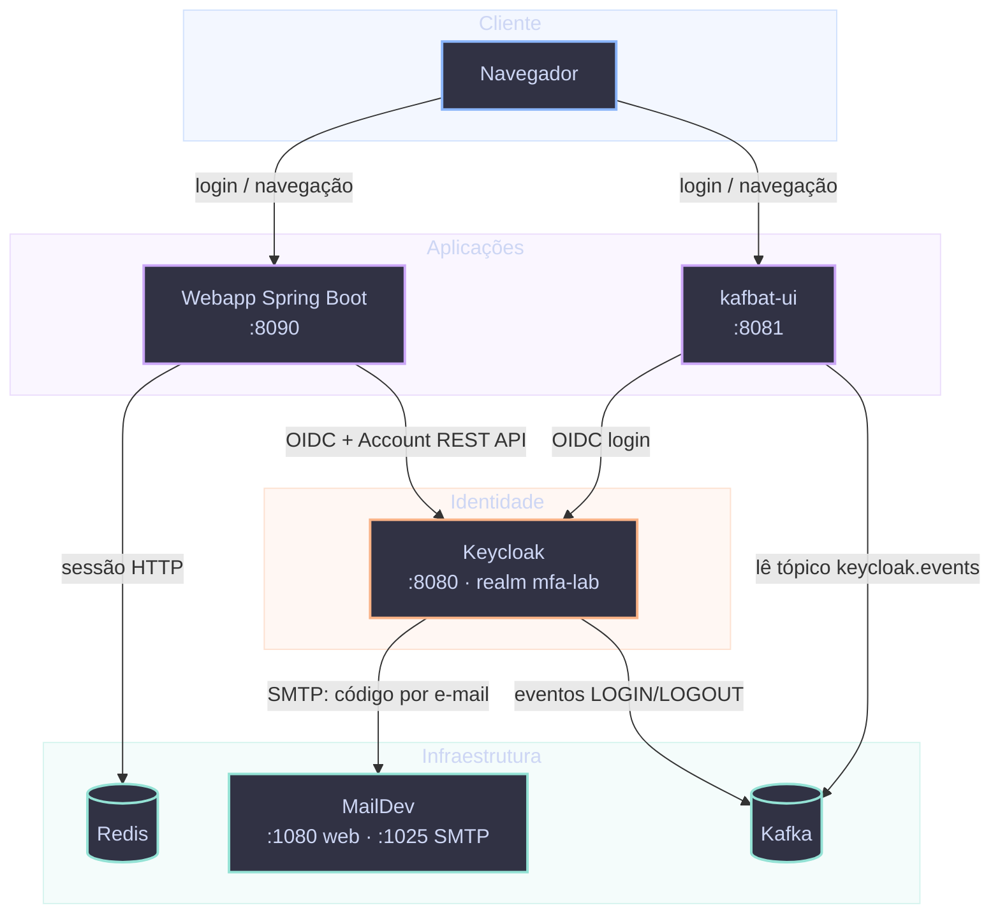

Praticamente todo sistema com mais de um punhado de usuários chega a um ponto em que "cada aplicação com seu próprio login" para de fazer sentido. É aí que entram **SSO** (Single Sign-On) e um servidor de identidade como o **Keycloak**.

Neste guia vamos primeiro entender os fundamentos: o que é SSO, como OAuth2 e OpenID Connect se relacionam, e os principais conceitos do Keycloak. Depois colocamos a mão na massa e construímos, passo a passo, um ambiente completo: tema customizado, um fluxo de autenticação próprio com 2º fator alternativo, auditoria de eventos via Kafka, e uma aplicação Spring Boot com login OIDC, sessão distribuída e autorização baseada em roles.

## Conteúdo

- [O que é SSO](#o-que-e-sso)
- [OAuth2: autorização delegada](#oauth2)
- [OIDC: identidade sobre o OAuth2](#oidc)
- [OIDC vs OAuth2](#oidc-vs-oauth2)
- [TOTP: segundo fator baseado em tempo](#totp)
- [Keycloak: conceitos principais](#keycloak-conceitos)
- [Construindo o ambiente: visão geral](#construindo-o-ambiente)
- [Passo 1: Realm, clients e users](#passo-1-realm-clients-users)
- [Passo 2: Tema customizado](#passo-2-tema-customizado)
- [Passo 3: Fluxo de autenticação customizado e 2FA](#passo-3-fluxo-2fa)
- [Passo 4: Event Listener com Kafka](#passo-4-kafka)
- [Passo 5: Autenticação na aplicação Spring e gerenciamento de sessão](#passo-5-spring-sessao)
- [Passo 6: Autorização, roles, mappers e RBAC](#passo-6-autorizacao)
- [Passo 7: Políticas de senha](#passo-7-politicas-senha)
- [Considerações finais](#consideracoes-finais)
- [Referências](#referencias)

## <a name="o-que-e-sso">O que é SSO</a>

**Single Sign-On** é o modelo em que o usuário se autentica **uma única vez** em um provedor de identidade central (o *Identity Provider*, ou IdP) e, a partir daí, acessa múltiplas aplicações **sem informar credenciais novamente** em cada uma. Em vez de cada aplicação validar usuário e senha contra seu próprio banco de dados, todas confiam em um terceiro central para dizer "sim, esse usuário é quem ele diz ser, e aqui estão os dados dele".

Isso resolve três problemas que crescem exponencialmente conforme o número de sistemas aumenta:

- **Experiência do usuário**: uma senha para lembrar, um login para fazer.
- **Segurança centralizada**: política de senha, MFA, bloqueio de conta e auditoria vivem em um único lugar, em vez de serem reimplementados (ou esquecidos) em cada aplicação.
- **Gestão de acesso**: desativar um usuário ou revogar um papel (role) em um único ponto propaga o efeito para todas as aplicações integradas. Isso inclui derrubar sessões ativas via *back-channel logout*, como veremos mais adiante.

O Keycloak é um IdP open source que implementa os dois protocolos que tornam esse modelo interoperável entre diferentes linguagens e frameworks: **OAuth2** e **OpenID Connect (OIDC)**.

## <a name="oauth2">OAuth2: autorização delegada</a>

OAuth2 ([RFC 6749](https://datatracker.ietf.org/doc/html/rfc6749)) é um protocolo de **autorização**, não de autenticação. Ele resolve o seguinte problema: como um usuário pode permitir que uma aplicação acesse um recurso seu, hospedado em outro serviço, **sem entregar sua senha para essa aplicação**?

O protocolo define quatro papéis:

- **Resource Owner**: o usuário, dono do recurso.
- **Client**: a aplicação que quer acessar o recurso.
- **Authorization Server**: quem autentica o usuário e emite tokens (o Keycloak).
- **Resource Server**: quem hospeda o recurso protegido e valida o token nas requisições.

O fluxo mais relevante hoje em dia é o **Authorization Code Flow com PKCE**. Na prática:

1. A aplicação redireciona o navegador para o Keycloak com um `code_challenge` (derivado de um segredo aleatório, o `code_verifier`, que só a aplicação conhece).
2. O usuário se autentica no Keycloak (username/senha, 2FA, etc.).
3. O Keycloak redireciona de volta com um `authorization code` de uso único.
4. A aplicação troca esse code por um **access token**, apresentando também o `code_verifier` original. É essa etapa que o PKCE (Proof Key for Code Exchange) protege: um code interceptado não pode ser trocado por outra parte que não tenha o verifier.

O resultado final desse fluxo é um **access token**: uma credencial de curta duração que o client anexa às requisições (`Authorization: Bearer <token>`) para acessar recursos em nome do usuário.

O OAuth2, por si só, não define nenhum formato padronizado para dizer quem é o usuário. O token pode ser opaco, e o Resource Server muitas vezes precisa consultar o Authorization Server para saber a quem ele pertence. É exatamente essa lacuna que o OIDC preenche.

## <a name="oidc">OIDC: identidade sobre o OAuth2</a>

**OpenID Connect** é uma camada de **autenticação e identidade** construída em cima do OAuth2. Ele reaproveita o mesmo fluxo (Authorization Code + PKCE) e adiciona duas peças que o OAuth2 puro não tem:

- **ID Token**: um [JWT](https://jwt.io) assinado que descreve *quem é o usuário* e *como/quando ele se autenticou*. Não é uma credencial de acesso a recursos, é um comprovante de identidade. Contém claims padronizadas como `sub` (identificador único do usuário), `iss` (emissor), `aud` (audiência/client), `auth_time` e `amr` (métodos de autenticação usados, útil para saber se 2FA foi exigido).
- **UserInfo Endpoint**: um endpoint padronizado (`/realms/{realm}/protocol/openid-connect/userinfo`) que devolve os atributos do usuário (nome, e-mail, etc.) a partir de um access token válido, sem exigir chamadas específicas de cada IdP.

Quem decide quais claims entram nesses tokens, e com quais valores, são regras configuráveis por client chamadas **protocol mappers**: vamos configurar alguns na parte prática deste guia. Frameworks como o Spring Security tratam a validação de tudo isso de forma transparente: conferem a assinatura do ID Token e expõem as claims através de um objeto de usuário autenticado, sem que a aplicação precise manipular JWT diretamente.

## <a name="oidc-vs-oauth2">OIDC vs OAuth2</a>

A confusão entre os dois é tão comum que vale reforçar a distinção com uma tabela direta:

| | OAuth2 | OIDC |
|---|---|---|
| Propósito | Autorização (acesso a um recurso) | Autenticação (identidade do usuário) |
| Pergunta que responde | "Esse client pode acessar X em nome do usuário?" | "Quem é esse usuário e como ele se autenticou?" |
| Token principal | Access Token (formato livre, muitas vezes opaco) | ID Token (sempre um JWT, formato padronizado) |
| Endpoint de perfil | Não definido pelo protocolo | UserInfo Endpoint padronizado |
| Escopo mínimo | Definido pela aplicação | `openid` (obrigatório para acionar o fluxo OIDC) |

Uma forma simples de fixar a diferença: **todo login "Entrar com Google/GitHub/Keycloak" que devolve nome e e-mail do usuário está usando OIDC**, mesmo que por baixo dos panos o transporte seja o mesmo Authorization Code Flow do OAuth2. O OAuth2 sozinho nunca deveria ser usado para "login". Ele foi desenhado para autorização de acesso a recursos (por exemplo, "permitir que este app leia meus repositórios do GitHub"), não para provar identidade.

## <a name="totp">TOTP: segundo fator baseado em tempo</a>

SSO resolve "um login para várias aplicações", mas concentra tudo numa credencial só, a senha. Se essa senha vazar, o estrago se propaga para todo o resto que confia naquele IdP. É por isso que MFA (autenticação multifator) é o complemento natural do SSO, e o mecanismo mais comum de segundo fator hoje em dia é o **TOTP** (*Time-based One-Time Password*, [RFC 6238](https://datatracker.ietf.org/doc/html/rfc6238)), o código de 6 dígitos que muda a cada 30 segundos em apps como Google Authenticator, Authy ou 1Password.

TOTP é uma variação com tempo do HOTP (*HMAC-based One-Time Password*, [RFC 4226](https://datatracker.ietf.org/doc/html/rfc4226)). A ideia central dos dois é a mesma: servidor e cliente compartilham um segredo secreto, gerado uma única vez no momento do cadastro, e cada lado calcula o mesmo código de forma independente, sem trocar nenhuma informação nova a cada login. A diferença é só o que entra como contador no cálculo:

- **HOTP** usa um contador incremental (login 1, login 2, login 3...), que precisa ficar sincronizado entre as partes e pode dessincronizar se um código gerado nunca for usado.
- **TOTP** troca esse contador pelo tempo Unix atual, dividido em janelas de 30 segundos. Não existe sincronização explícita: servidor e app calculam a mesma janela porque ambos sabem que horas são, o que elimina o problema de dessincronização do HOTP, desde que o relógio dos dois lados não derive demais. Servidores costumam aceitar a janela atual e a anterior/seguinte justamente para absorver essa pequena diferença.

Em ambos os casos, o código final é o resultado de um HMAC (com SHA-1, na prática mais comum) sobre o segredo compartilhado e o contador, truncado para os 6 dígitos que você digita. Ninguém troca o código pela rede antes do login: ele é *derivado*, não *transmitido*. É isso que torna o TOTP resistente a um atacante que só conseguiu interceptar tráfego, ao contrário de uma senha reutilizável.

O cadastro (*enrollment*) normalmente acontece via QR code: o servidor gera uma URI no formato `otpauth://totp/...?secret=...&issuer=...`, o app autenticador escaneia e guarda o segredo localmente. A partir daí, nenhuma rede é necessária para gerar códigos, o que é ao mesmo tempo a maior vantagem do TOTP (funciona offline, não depende de operadora nem de entrega de e-mail) e sua maior fricção de adoção (exige instalar um app e guardar o segredo com cuidado, já que perdê-lo sem ter salvo códigos de recuperação significa perder o acesso).

É exatamente essa fricção de adoção que motiva o e-mail OTP como alternativa que vamos construir neste guia: mais fraco como segundo fator (compromete a segurança se a caixa de e-mail também estiver comprometida, e depende da latência de entrega), mas sem exigir que o usuário já tenha um app autenticador configurado. O Keycloak trata TOTP como um tipo de credencial nativo do usuário (mesmo `CredentialModel` usado para senha), configurável via a *Required Action* `CONFIGURE_TOTP`, que detalhamos na próxima seção. É esse suporte nativo que a condição `conditional-user-configured`, usada no fluxo deste guia, consulta para saber se o usuário já tem TOTP configurado ou não.

## <a name="keycloak-conceitos">Keycloak: conceitos principais</a>

Com a teoria de protocolo resolvida, os termos do Keycloak caem no lugar naturalmente:

- **Realm**: um domínio de segurança isolado. Usuários, clients, roles e configurações de um realm não enxergam nem afetam outro. É o equivalente a um "tenant" (um realm `acme-corp` não vê nada do que existe em um realm `parceiros`, mesmo na mesma instância do Keycloak).
- **Client**: uma aplicação ou serviço registrado no realm que pode solicitar autenticação e tokens. Pode ser **público** (SPA, app mobile, sem segredo, PKCE obrigatório) ou **confidencial** (backend, com client secret). A escolha depende de onde esse segredo pode ser armazenado com segurança.
- **Users**: as identidades gerenciadas pelo realm, com nome, e-mail, atributos customizados e as credenciais associadas (senha, TOTP, e outras).
- **Roles**: permissões nomeadas, atribuíveis a usuários. Podem ser **de realm** (globais, válidas para qualquer client) ou **de client** (escopadas a um client específico).
- **Groups**: coleções de usuários que herdam roles em conjunto. Não usamos no nosso laboratório, mas é bom saber que existe para cenários maiores.
- **User Profile**: o schema declarativo de atributos de usuário, definindo quais campos existem (nome, e-mail, atributos customizados) e quem pode vê-los ou editá-los. É essa peça que permite, por exemplo, declarar um atributo `phoneNumber` editável pelo próprio usuário, sem tocar em código.
- **Authentication Flow**: a sequência declarativa de passos que compõe um login (usuário/senha, 2FA, etc.). É o assunto de uma das próximas seções.
- **Required Actions** e **Application Initiated Actions (AIA)**: ações que o Keycloak pode forçar no usuário (`UPDATE_PASSWORD`, `CONFIGURE_TOTP`), tanto automaticamente (marcadas no usuário) quanto sob demanda, quando uma aplicação client redireciona para o endpoint de autorização passando `kc_action=CONFIGURE_TOTP`. É assim que uma aplicação cliente consegue oferecer "trocar senha" ou "configurar 2º fator" delegando 100% da tela sensível para o próprio Keycloak, sem reimplementar esses formulários do zero.

## <a name="construindo-o-ambiente">Construindo o ambiente: visão geral</a>

Com os conceitos no lugar, vamos aplicar cada um deles construindo um ambiente real, de ponta a ponta. O objetivo, hospedado localmente via Docker Compose, é:

- Um Keycloak com um fluxo de login customizado: segundo fator por e-mail quando o usuário ainda não configurou um app autenticador TOTP, e o TOTP normal quando já configurou.
- Um listener publicando eventos de login e logout (e seus erros) no Kafka.
- Um tema visual próprio para as telas de login e e-mail.
- Uma aplicação Spring Boot com login OIDC, sessão em Redis e páginas de autoatendimento para senha, 2º fator e dados cadastrais.
- Uma interface de administração do Kafka (kafbat-ui) autenticada via SSO no mesmo Keycloak, com autorização por role.

Antes de entrar nos passos, vale visualizar como essas peças conversam entre si. É esse desenho que cada um dos sete passos a seguir vai preenchendo, pedaço por pedaço:



O navegador só fala diretamente com as duas aplicações, webapp e kafbat-ui (Passos 5 e 6); nenhuma delas manuseia senha ou código de 2FA, quem faz isso é sempre o Keycloak, no centro do desenho. Redis guarda a sessão HTTP da webapp (Passo 5), o MailDev recebe os e-mails de segundo fator que o Keycloak envia (Passos 1 e 3), e o Kafka carrega os eventos de login/logout que o Keycloak publica (Passo 4) e que o kafbat-ui lê de volta, já autorizado por role (Passo 6).

Vamos montar isso na ordem natural de construção: primeiro o realm e os clients, depois o tema, o fluxo de autenticação, o listener de eventos, a aplicação cliente e, por fim, autorização e política de senha. Nos passos que envolvem configuração do Keycloak, vamos direto ao Admin Console: é como a maioria das pessoas realmente configura um realm no dia a dia, e cada tela abaixo é uma captura real do ambiente rodando localmente (o Keycloak também aceita descrever tudo isso como um `realm-export.json` para importar de uma vez, o que é ótimo para automatizar, mas foge do que essas telas mostram).

## <a name="passo-1-realm-clients-users">Passo 1: Realm, clients e users</a>

Antes de clicar em qualquer tela, precisamos de um Keycloak rodando. O `docker-compose.yml` deste laboratório define um serviço `keycloak` que builda a imagem a partir de um Dockerfile próprio, em vez de usar a imagem oficial pura (esse Dockerfile empacota o tema e as extensões customizadas que vamos construir nos próximos passos):

```yaml
keycloak:
  build:
    context: ..
    dockerfile: docker/keycloak/Dockerfile
  environment:
    KC_BOOTSTRAP_ADMIN_USERNAME: admin
    KC_BOOTSTRAP_ADMIN_PASSWORD: admin
    KC_HOSTNAME: keycloak
    KC_HOSTNAME_PORT: "8080"
    KC_HOSTNAME_STRICT: "false"
    KC_HTTP_ENABLED: "true"
    KC_PROXY_HEADERS: "xforwarded"
  ports:
    - "8080:8080"
  healthcheck:
    test: ["CMD-SHELL", "exec 3<>/dev/tcp/127.0.0.1/8080 || exit 1"]
    interval: 10s
    timeout: 5s
    retries: 15
    start_period: 60s
```

Esse `Dockerfile` ainda não existe pronto: vamos construí-lo ao longo do guia, estágio por estágio, conforme tema e extensões entram em cena. Por enquanto, seu esqueleto é só a imagem oficial do Keycloak, subindo em modo dev:

```dockerfile
FROM quay.io/keycloak/keycloak:26.7.0 AS final

ENTRYPOINT ["/opt/keycloak/bin/kc.sh", "start-dev"]
```

Isso já basta para subir um Keycloak funcional, só que sem o tema e as SPIs customizadas. Os Passos 2 e 3 vão adicionando estágios de build a esse mesmo arquivo, um para o tema, outro para as extensões, até ele chegar à forma final que builda a imagem completa.

(mais adiante, no passo do Kafka, esse mesmo serviço ganha mais algumas variáveis de ambiente; por ora, essas já bastam para subir e acessar o Admin Console.)

Dois detalhes evitam surpresa aqui. Primeiro, `KC_HOSTNAME: keycloak` fixa o hostname que o Keycloak usa para montar suas próprias URLs, incluindo o `iss` (issuer) que vai parar dentro de cada token. Isso significa que o seu navegador e os outros containers precisam enxergar `keycloak` como um endereço válido e resolver para o mesmo lugar, então vale mapear isso no seu `/etc/hosts` antes de subir qualquer coisa:

```bash
echo "127.0.0.1 keycloak" | sudo tee -a /etc/hosts
```

Segundo, o `healthcheck` não é só formalidade: outros serviços do compose (a webapp do Passo 5, o kafbat-ui do Passo 6) declaram `depends_on: keycloak: condition: service_healthy`, e sem um healthcheck que espera a porta HTTP realmente responder, eles tentam se conectar a um Keycloak que ainda está de boot e falham logo na primeira tentativa.

Com isso no lugar, subir o Keycloak é:

```bash
cd docker
docker compose up --build keycloak
```

O `--build` é obrigatório na primeira vez, e de novo sempre que o Dockerfile mudar, como vai acontecer quando adicionarmos tema e extensões. Depois de alguns segundos o Admin Console fica disponível em `http://keycloak:8080`, login `admin` / `admin`. É daí que todo o resto deste guia parte.

Tudo começa criando o realm: **Manage realms → Create realm**. O nosso se chama `mfa-lab`:


Dentro dele, registramos dois clients OIDC confidenciais em **Clients → Create client**. O primeiro é a aplicação Spring Boot que vamos construir mais adiante. Na aba Settings, os campos que importam são:

- **Client ID**: `webapp`
- **Valid redirect URIs**: `http://keycloak:8090/login/oauth2/code/keycloak` (o callback padrão que o Spring Security expõe para o registration `keycloak`, na porta que a webapp vai ocupar no Passo 5)
- **Web origins**: `http://keycloak:8090`


Na aba Capability config, ligamos **Client authentication** (torna o client confidencial, com secret) e deixamos apenas **Standard flow** marcado, o Authorization Code Flow explicado na seção de OAuth2:


Ao salvar, a aba Credentials passa a mostrar o Client secret gerado. Guarde esse valor: ele volta a aparecer, exatamente igual, na configuração da webapp no Passo 5. Neste guia usamos `webapp-secret-change-me` para não complicar quem for copiando os exemplos.

O segundo client é o **kafbat-ui**, a interface de administração do Kafka que vamos autenticar via SSO mais adiante, registrado do mesmo jeito (Client authentication ligado, apenas Standard flow habilitado), mudando só o suficiente para apontar para sua própria porta:

- **Client ID**: `kafbat-ui`
- **Valid redirect URIs**: `http://keycloak:8081/login/oauth2/code/keycloak`
- **Web origins**: `http://keycloak:8081`

O secret desse client usamos como `kafbat-ui-secret-change-me`, valor que reaparece na configuração do kafbat-ui no Passo 6.

Duas roles de realm completam essa base, criadas em **Realm roles → Create role**, para autorizar o acesso ao kafbat-ui mais à frente:


Como a webapp vai deixar o próprio usuário editar telefone além dos campos padrão, declaramos esse atributo customizado antes de criar os usuários: **Realm settings → User profile → Create attribute**, com nome `phoneNumber` e permissão de visualização e edição para `admin` e `user`:


Com o atributo declarado, ele passa a aparecer no formulário de qualquer usuário do realm. Criamos dois usuários seed em **Users → Add user**:

- `alice`, e-mail `alice@mfa-lab.test`, sobrenome Silva.
- `bob`, e-mail `bob@mfa-lab.test`, sobrenome Souza.

Nenhum dos dois nasce com TOTP configurado, então os dois caem no branch de e-mail no primeiro login. É a própria `alice` quem configura um app autenticador mais adiante, no roteiro de verificação do Passo 7, para exercitar o segundo branch sem precisar de um terceiro usuário só para isso.

Nos dois, vale marcar **Email verified** como ligado, já que não existe fluxo de verificação de e-mail neste laboratório.


A senha é definida na aba Credentials, com **Reset password** (marcando "Temporary" como desligado, para não forçar troca no primeiro login de teste). Para os dois usuários, usamos `Password123!`: já satisfaz de saída a política de senha que vamos declarar no Passo 7, então não trava na primeira tentativa.


**E-mail: um SMTP fake, para não depender de credencial real.** O fluxo de segundo fator por e-mail que vamos construir no Passo 3 só funciona se o Keycloak conseguir efetivamente enviar e-mail, e configurar um SMTP de verdade (autenticação, TLS, domínio validado) é fricção demais para um ambiente local. Por isso o compose sobe também um serviço `maildev`, um SMTP fake que aceita qualquer mensagem e mostra tudo numa interface web, sem entregar nada de verdade para fora da rede local:

```yaml
maildev:
  image: maildev/maildev:latest
  ports:
    - "1080:1080"   # interface web, para ler os e-mails capturados
    - "1025:1025"   # porta SMTP, para onde o Keycloak aponta
```

Do lado do Keycloak, a conexão é configurada em **Realm settings → Email**:


Os campos que importam são poucos: `From` e `From display name` definem o remetente que aparece nos e-mails (usamos `no-reply@mfa-lab.test` / `MFA Lab`); `Host` e `Port` apontam para `maildev` na porta `1025`, o nome do serviço e a porta SMTP do compose; e `Enable SSL`/`Enable StartTLS` ficam desligados, porque o maildev não fala TLS. Sem essa conexão configurada, o botão `Test connection` da própria tela falha, e qualquer authenticator que dependa do `EmailTemplateProvider` do Keycloak, o nosso `EmailOtpAuthenticator` do Passo 3 incluso, falha silenciosamente ao tentar enviar.

Com o serviço no ar, todo e-mail que o Keycloak manda pode ser conferido em `http://localhost:1080`, sem precisar de nenhuma caixa de entrada real:


Com isso o esqueleto do realm já existe. As próximas seções vão preenchendo cada peça: tema, fluxo de autenticação, eventos e, por fim, os protocol mappers que faltam para autorização funcionar de ponta a ponta.

## <a name="passo-2-tema-customizado">Passo 2: Tema customizado</a>

Com o realm no lugar, é hora de dar cara própria às telas que ele renderiza. O Keycloak desenha todas elas (login, e-mails, páginas de conta) através de um sistema de temas baseado em [FreeMarker](https://freemarker.apache.org/), organizado em "tipos" (`login`, `email`, `account`, `admin`). Um tema customizado normalmente **estende** um tema base (`keycloak.v2`) em vez de reescrever tudo do zero. Assim, telas que você não personalizou (como a de TOTP nativa) continuam funcionando, herdando apenas o CSS do tema pai.

Esse módulo tem essa estrutura de pastas:

```
keycloak-theme/
├── pom.xml
└── src/main/resources/
    ├── META-INF/
    │   └── keycloak-themes.json
    └── theme/mfa-lab/
        ├── login/
        │   ├── theme.properties
        │   ├── login-email-otp.ftl
        │   ├── messages/
        │   │   ├── messages_en.properties
        │   │   └── messages_pt_BR.properties
        │   └── resources/css/mfa-lab.css
        └── email/
            ├── theme.properties
            ├── html/email-otp-code.ftl
            ├── text/email-otp-code.ftl
            └── messages/
                ├── messages_en.properties
                └── messages_pt_BR.properties
```

Cada `theme.properties` marca o pai que esse tipo de tema estende, e cada `.ftl`/`.css`/`.properties` sobrescreve exatamente uma peça daquele pai. É essa estrutura que os próximos parágrafos explicam arquivo por arquivo.

A estrutura mínima é declarada em `META-INF/keycloak-themes.json`:

```json
{
  "themes": [
    { "name": "mfa-lab", "types": ["login", "email"] }
  ]
}
```

E cada tipo de tema tem seu próprio `theme.properties` apontando o pai:

```properties
# login/theme.properties
parent=keycloak.v2
```

```properties
# email/theme.properties
parent=base
```

A partir daí, qualquer arquivo `.ftl` colocado na pasta certa **sobrescreve** o equivalente do tema pai. Neste laboratório criamos apenas duas telas próprias, porque tudo o mais (login, TOTP, troca de senha) já vem do `keycloak.v2`:

- `login/login-email-otp.ftl`: a tela do código de segundo fator por e-mail (nossa própria SPI de autenticação, coberta no próximo passo).
- `email/html/email-otp-code.ftl` e `email/text/email-otp-code.ftl`: o corpo do e-mail com o código.

Um detalhe frequentemente esquecido: para internacionalizar as telas customizadas é preciso declarar as mensagens em arquivos `messages_<locale>.properties` dentro do próprio tema (`messages_en.properties`, `messages_pt_BR.properties`). O Keycloak resolve a chave (`${emailOtpFormTitle}` nos `.ftl`) contra o locale ativo, com fallback para o tema pai se a chave não existir no seu tema.

Esse tema vive num módulo Maven à parte, separado do código Java das extensões. É um módulo só de recursos, sem nenhuma classe: o `pom.xml` não declara dependência alguma, só fixa um `finalName` (`keycloak-theme-${project.version}`), porque o jar final só precisa conter `theme/mfa-lab/**` e o `keycloak-themes.json` para o Keycloak encontrar o tema. Empacotar é o `mvn` de sempre:

```bash
cd keycloak-theme
mvn -DskipTests package
```

O resultado cai em `target/keycloak-theme-1.0.0.jar`. Isso é exatamente o que o primeiro estágio novo entra no `Dockerfile` esboçado no Passo 1, antes do estágio `final`:

```dockerfile
FROM maven:3.9-eclipse-temurin-17 AS build-theme
WORKDIR /src
COPY keycloak-theme/pom.xml .
COPY keycloak-theme/src ./src
RUN mvn -q -DskipTests package
```

E, dentro do estágio `final` que já vimos no Passo 1, esse jar é copiado para dentro de `/opt/keycloak/providers/`, a pasta que o Keycloak varre em busca de providers extras. É aqui também que o `kc.sh build` entra em cena, logo antes do `ENTRYPOINT`:

```dockerfile
COPY --from=build-theme /src/target/keycloak-theme-*.jar /opt/keycloak/providers/
RUN /opt/keycloak/bin/kc.sh build
```

`kc.sh build` é quem efetivamente registra esse novo provider (tema ou extensão) na build interna do Quarkus que sustenta o Keycloak. Esse passo **precisa** ser repetido a cada mudança em tema ou extensão, seja rodando o `mvn package` e reiniciando manualmente, seja simplesmente refazendo `docker compose up --build`. Senão o Keycloak sobe normalmente, mas ignora silenciosamente o que mudou.

## <a name="passo-3-fluxo-2fa">Passo 3: Fluxo de autenticação customizado e 2FA</a>

A peça central deste laboratório é o fluxo que decide entre pedir TOTP ou mandar um código por e-mail. Ele só depende do realm, dos clients e dos dois usuários que criamos no Passo 1. O tema customizado do Passo 2 é opcional aqui: sem ele, o Keycloak simplesmente renderiza essas telas com o visual padrão do `keycloak.v2`, e o fluxo funciona igual. Authentication Flows no Keycloak são compostos por **executions**, cada uma com um `requirement`:

- `REQUIRED`: precisa passar.
- `ALTERNATIVE`: qualquer uma entre as alternativas do mesmo nível resolve o passo.
- `CONDITIONAL`: um subflow que só roda se uma **condição** (também uma execution, do tipo `ConditionalAuthenticator`) for satisfeita.
- `DISABLED`: ignorada.

O objetivo é simples de enunciar: se o usuário **já tem TOTP configurado** (app autenticador), pedir o código TOTP; senão, mandar um código por e-mail como segundo fator. A tentação seria resolver isso com um `if` dentro de uma única SPI Java. Mas o Keycloak já tem um mecanismo declarativo para exatamente esse tipo de decisão, e o roteamento inteiro vive no flow, não no código.

Só que esse roteamento depende de duas peças que o Keycloak não traz de fábrica: uma condição que reconheça "usuário sem TOTP configurado" e um autenticador que envie e valide o código por e-mail. Sem elas, o Admin Console nem mostra essas opções na hora de montar o flow, então a ordem certa é: primeiro escrever e buildar essa extensão, depois configurar o flow. As três SPIs deste laboratório (essa condição, o autenticador de e-mail e o listener do Kafka que vamos ver no próximo passo) moram juntas num único módulo Maven:

```
keycloak-extensions/
├── pom.xml
└── src/main/
    ├── java/br/com/caiquejh/keycloak/
    │   ├── condition/
    │   │   ├── OtpNotConfiguredCondition.java
    │   │   └── OtpNotConfiguredConditionFactory.java
    │   ├── otp/
    │   │   ├── EmailOtpAuthenticator.java
    │   │   ├── EmailOtpAuthenticatorFactory.java
    │   │   └── EmailOtpConstants.java
    │   └── events/
    │       ├── KafkaEventListenerProvider.java
    │       ├── KafkaEventListenerProviderFactory.java
    │       └── dto/UserEventMessage.java
    └── resources/META-INF/services/
        ├── org.keycloak.authentication.AuthenticatorFactory
        └── org.keycloak.events.EventListenerProviderFactory
```

Cada `*Factory` é o que o Keycloak instancia via os arquivos em `META-INF/services/`, e cada classe sem o sufixo é a implementação de fato. Vamos olhar `condition/` e `otp/` agora; `events/` é assunto do Passo 4.

`conditional-user-configured` já existe nativamente no Keycloak (verdadeiro se o usuário tem a credencial configurada). O "senão" lógico não tem um nativo pronto, então escrevemos uma terceira SPI pequena cuja única responsabilidade é negar essa condição:

```java
public class OtpNotConfiguredCondition implements ConditionalAuthenticator {
    @Override
    public boolean matchCondition(AuthenticationFlowContext context) {
        UserModel user = context.getUser();
        return !user.credentialManager().isConfiguredFor(OTPCredentialModel.TYPE);
    }
}
```

Como as duas condições (`conditional-user-configured` e sua negação) são mutuamente exclusivas, exatamente um dos dois branches roda por login. Nenhuma lógica de "qual segundo fator usar" vive em Java. Só a checagem booleana de cada condição; o roteamento é 100% do flow.

A SPI que efetivamente gera, envia e valida o código por e-mail (`EmailOtpAuthenticator`) implementa a interface `Authenticator` do Keycloak, que resolve em dois métodos: `authenticate()`, chamado na primeira vez que o passo do flow roda, e `action()`, chamado quando o usuário submete o formulário. É parametrizável via `ConfigurableAuthenticatorFactory`: tamanho do código, TTL e número máximo de tentativas viram campos configuráveis no admin console, sem exigir rebuild. `authenticate()` só gera o código e desenha a tela:

```java
@Override
public void authenticate(AuthenticationFlowContext context) {
    sendNewCode(context);
    context.challenge(context.form().createForm(EmailOtpConstants.FORM_TEMPLATE));
}
```

`sendNewCode` grava o código, o horário de expiração e um contador de tentativas como *auth notes* da `AuthenticationSessionModel`, memória de sessão de autenticação que não é persistida no banco do Keycloak. Faz sentido para um segredo de curtíssima duração:

```java
authSession.setAuthNote(EmailOtpConstants.NOTE_CODE, code);
authSession.setAuthNote(EmailOtpConstants.NOTE_EXPIRES_AT, String.valueOf(expiresAt));
authSession.setAuthNote(EmailOtpConstants.NOTE_ATTEMPTS, "0");
```

É em `action()` que a validação de fato acontece, e ela cobre os três jeitos de um segundo fator poder falhar: código expirado, código errado (com limite de tentativas) e reenvio pedido pelo usuário:

```java
if (Instant.now().isAfter(Instant.ofEpochMilli(Long.parseLong(expiresAtRaw)))) {
    context.failureChallenge(AuthenticationFlowError.EXPIRED_CODE,
            context.form().setError("emailOtpExpired").createForm(EmailOtpConstants.FORM_TEMPLATE));
    return;
}

if (submittedCode == null || !constantTimeEquals(expectedCode, submittedCode)) {
    int attempts = incrementAttempts(authSession);
    if (attempts >= getMaxAttempts(context)) {
        context.failureChallenge(AuthenticationFlowError.INVALID_CREDENTIALS,
                context.form().setError("emailOtpMaxAttempts").createForm(EmailOtpConstants.FORM_TEMPLATE));
        return;
    }
    context.failureChallenge(AuthenticationFlowError.INVALID_CREDENTIALS,
            context.form().setError("emailOtpInvalid").createForm(EmailOtpConstants.FORM_TEMPLATE));
    return;
}

clearNotes(authSession);
context.success();
```

A comparação usa `MessageDigest.isEqual` (tempo constante) em vez de `String.equals`, para não vazar informação por *timing attack*: comparar strings caractere a caractere pode retornar um pouco mais rápido quanto mais cedo uma diferença aparece, e um atacante com tempo e paciência consegue, em teoria, usar essa diferença para adivinhar o código um dígito por vez.

Registrar a SPI é um detalhe fácil de errar: o arquivo de serviço correto é `META-INF/services/org.keycloak.authentication.AuthenticatorFactory`, inclusive para a `ConditionalAuthenticatorFactory`. É por essa interface (`AuthenticatorFactory`) que o *provider loader* do Keycloak varre o classpath, não pelo nome mais específico da subinterface condicional.

Esse código Java vive num segundo módulo Maven, separado do módulo do tema, porque aqui sim há dependências para resolver: as três SPIs (a condição, o autenticador de e-mail e o listener do Kafka do próximo passo) compilam contra as APIs internas do Keycloak (`keycloak-server-spi`, `keycloak-server-spi-private`, `keycloak-services`, `keycloak-core`), todas com `scope: provided`, porque essas classes já estão disponíveis em runtime dentro do próprio servidor. O build é o mesmo comando de sempre:

```bash
cd keycloak-extensions
mvn -DskipTests package
```

No `Dockerfile`, é mais um estágio novo, que builda em paralelo ao do tema, gerando `keycloak-extensions-1.0.0.jar`, também copiado para `/opt/keycloak/providers/` antes do `kc.sh build`:

```dockerfile
FROM maven:3.9-eclipse-temurin-17 AS build-ext
WORKDIR /src
COPY keycloak-extensions/pom.xml .
COPY keycloak-extensions/src ./src
RUN mvn -q -DskipTests package
```

Com o jar buildado e o `kc.sh build` já rodado dentro da imagem (a mesma engrenagem do Passo 2, só que num segundo `COPY --from`), as duas SPIs passam a existir na paleta de executions do Admin Console. Só agora faz sentido ir montar o flow.

Juntando os três pedaços que fomos acrescentando desde o Passo 1, esse é o `Dockerfile` completo: dois estágios de build rodando em paralelo (tema e extensões) e um estágio final que empacota os dois jars e roda o `kc.sh build`:

```dockerfile
FROM maven:3.9-eclipse-temurin-17 AS build-ext
WORKDIR /src
COPY keycloak-extensions/pom.xml .
COPY keycloak-extensions/src ./src
RUN mvn -q -DskipTests package

FROM maven:3.9-eclipse-temurin-17 AS build-theme
WORKDIR /src
COPY keycloak-theme/pom.xml .
COPY keycloak-theme/src ./src
RUN mvn -q -DskipTests package

FROM quay.io/keycloak/keycloak:26.7.0 AS final

COPY --from=build-ext /src/target/keycloak-extensions-*.jar /opt/keycloak/providers/
COPY --from=build-theme /src/target/keycloak-theme-*.jar /opt/keycloak/providers/

RUN /opt/keycloak/bin/kc.sh build

ENTRYPOINT ["/opt/keycloak/bin/kc.sh", "start-dev"]
```

Criamos um flow chamado `browser-email-otp` (cópia do `browser` padrão, em **Authentication → Flows → Create flow**, opção **Duplicate** sobre o flow `browser` existente) e o definimos como o browser flow do realm, em **Realm settings → Login**:


Duplicar o `browser` já traz pronto o topo da árvore: Cookie e Identity Provider Redirector como Alternative, e um subflow de formulário Alternative com usuário/senha Required. O trabalho manual começa dentro desse subflow de formulário, substituindo a etapa única de OTP que o flow padrão tem por um roteamento condicional. Clicando em **Add step**:

1. **Add step → Create subflow**, nomeado `browser-email-otp 2fa`, com o dropdown de Requirement em `Required`. É o subflow que substitui a etapa de segundo fator do `browser` original.
2. Dentro dele, de novo **Add step → Create subflow**, duas vezes: um chamado `browser-email-otp otp-branch` e outro `browser-email-otp email-branch`. Os dois ficam com Requirement `Conditional`, não `Required`. É esse ajuste no dropdown que os transforma em branches avaliados por uma condição interna, em vez de passos obrigatórios em sequência.
3. No branch `otp-branch`: **Add condition → Condition - user configured** (a condição nativa `conditional-user-configured`) com Requirement `Required`, seguida de **Add step → OTP Form**, também `Required`.
4. E no `email-branch`, a mesma receita, trocando só a condição pela nossa: **Add condition → Condition - OTP Not Configured** (a `OtpNotConfiguredConditionFactory` que acabamos de buildar), seguida de **Add step → Email OTP**, a SPI de autenticação que envia e valida o código. Se esses dois nomes não aparecerem no dropdown, o motivo quase sempre é o jar não ter sido rebuildado (`docker compose up --build`) depois da última mudança.

Nesse último passo, abrindo a engrenagem de configuração da execution `Email OTP`, criamos um Authenticator config chamado `email-otp-config` com os três campos que a nossa `ConfigurableAuthenticatorFactory` declara: tamanho do código `6`, expiração em minutos `5` e máximo de tentativas `5`. São os mesmos valores default da SPI, então bastaria deixar em branco, mas declarar explicitamente deixa claro que esses números são ajustáveis sem rebuild.

O resultado final, depois desses cliques todos, é a árvore abaixo. Vale reler a receita acima como padrão geral: subflow com o Requirement certo primeiro (Required para sequência, Conditional para branch alternativo), depois Add condition (quando existe uma condição) ou Add step (para o autenticador em si) dentro dele:


## <a name="passo-4-kafka">Passo 4: Event Listener com Kafka</a>

Agora vamos auditar quem loga, de onde e quando. Esse listener escuta qualquer login do realm `mfa-lab` criado no Passo 1, inclusive o fluxo `browser` padrão do Keycloak; ele não exige o flow condicional que montamos no Passo 3, só um realm com eventos habilitados. Auditoria de autenticação raramente deveria ficar presa apenas nos logs do Keycloak: em geral você quer alimentar um SIEM, um data lake ou disparar automações a partir desses eventos. O Keycloak expõe exatamente esse gancho via `EventListenerProvider`:

```java
public class KafkaEventListenerProvider implements EventListenerProvider {

    static final Set<EventType> PUBLISHED_EVENT_TYPES = EnumSet.of(
            EventType.LOGIN, EventType.LOGIN_ERROR,
            EventType.LOGOUT, EventType.LOGOUT_ERROR,
            EventType.REGISTER, EventType.REGISTER_ERROR
    );

    @Override
    public void onEvent(Event event) {
        if (!PUBLISHED_EVENT_TYPES.contains(event.getType())) {
            return;
        }
        UserEventMessage message = new UserEventMessage(
                event.getType().name(), event.getRealmId(), event.getUserId(),
                event.getClientId(), event.getIpAddress(), event.getTime(), event.getDetails());
        String json = objectMapper.writeValueAsString(message);
        producer.send(new ProducerRecord<>(topic, event.getUserId(), json));
    }

    @Override
    public void onEvent(AdminEvent event, boolean includeRepresentation) {
        // fora de escopo: só eventos de usuário (LOGIN/LOGOUT/erros) são publicados
    }
}
```

Alguns pontos que valem a pena destacar:

- **Filtragem por `EnumSet`**: publicamos só o que interessa (login/logout e seus erros, mais registro de conta), não o firehose de todos os `EventType` disponíveis. Isso evita ruído no tópico e reduz a superfície de dados sensíveis trafegando pela rede.
- **DTO próprio (`UserEventMessage`)**, não o `Event` cru do Keycloak: serializar o objeto interno do Keycloak diretamente acopla o contrato do tópico Kafka à versão interna do servidor de identidade. Qualquer consumidor a jusante quebra silenciosamente se essa classe mudar entre versões.
- **`onEvent(AdminEvent, boolean)` é obrigatório** mesmo sendo no-op aqui. É outro método da mesma interface, que cobre ações administrativas (criar usuário, mudar configuração), fora do escopo deste laboratório.
- **Shading de dependências**: o módulo empacota `kafka-clients` e Jackson, relocando os pacotes (`maven-shade-plugin`) para não colidir com o classpath interno do próprio Keycloak, que já carrega sua própria versão de Jackson.
- **`compression.type=none`** no producer: uma escolha deliberada para não precisar relocar bibliotecas nativas (snappy/lz4/zstd, que usam JNI). Shading de bibliotecas com bindings nativos é um risco conhecido e desnecessário para o volume de eventos de um laboratório.

A configuração de bootstrap servers e tópico chega via `Config.Scope`, alimentado por variáveis de ambiente com a convenção `KC_SPI_EVENTS_LISTENER_<NOME_DO_PROVIDER>_<CHAVE>`:

```yaml
environment:
  KC_SPI_EVENTS_LISTENER_KAFKA_EVENT_LISTENER_BOOTSTRAP_SERVERS: kafka:9092
  KC_SPI_EVENTS_LISTENER_KAFKA_EVENT_LISTENER_TOPIC: keycloak.events
  KC_EVENTS_LISTENER: jboss-logging,kafka-event-listener
```

Note que `KC_EVENTS_LISTENER` precisa **listar explicitamente** `jboss-logging` junto com o listener customizado. Omitir esse valor não desativa só o Kafka: desativa o log padrão também, já que a propriedade substitui a lista inteira em vez de somar a ela. E sem `eventsEnabled: true` no realm, nenhum listener recebe evento algum, custom ou não. Esse mesmo interruptor também existe direto no Admin Console, em **Realm settings → User events settings → Save events**, caso você prefira ligar por lá em vez de mexer no JSON.

Dá para confirmar que os eventos realmente chegam sem escrever nenhum consumidor: basta abrir o tópico `keycloak.events` pelo kafbat-ui, a interface de administração do Kafka que vamos configurar com SSO no Passo 6. Qualquer login, logout ou erro de autenticação aparece ali como uma mensagem JSON, exatamente o `UserEventMessage` que o listener acima serializou.

## <a name="passo-5-spring-sessao">Passo 5: Autenticação na aplicação Spring e gerenciamento de sessão</a>

Esta seção monta a aplicação que efetivamente usa esse login: uma webapp Spring Boot (Spring Boot 4.1, Java 24). Ela só precisa do client `webapp` registrado no Passo 1, com o client ID e o secret que guardamos ali. Tema, fluxo de 2FA e o listener do Kafka rodam de forma independente e não interferem em nada do que vem a seguir. O `pom.xml` é enxuto: `spring-boot-starter-oauth2-client` cuida do login OIDC, `spring-boot-starter-web` e `spring-boot-starter-thymeleaf` renderizam as páginas, e `spring-boot-starter-session-data-redis` entra na parte de sessão distribuída, mais adiante nesta mesma seção. A estrutura do módulo:

```
webapp/
├── pom.xml
├── Dockerfile
└── src/main/
    ├── java/br/com/caiquejh/mfalab/
    │   ├── MfaLabApplication.java
    │   ├── account/
    │   │   ├── AccountApiClient.java
    │   │   ├── CredentialInfo.java
    │   │   └── ProfileForm.java
    │   ├── config/
    │   │   ├── SecurityConfig.java
    │   │   ├── KcActionAuthorizationRequestResolver.java
    │   │   └── KcActionAwareSuccessHandler.java
    │   └── web/
    │       ├── DashboardController.java
    │       ├── ProfileController.java
    │       └── SecurityController.java
    └── resources/
        ├── application.yml
        ├── static/css/app.css
        └── templates/
            ├── dashboard.html
            ├── profile.html
            ├── security.html
            └── fragments/nav.html
```

`account/` fala com a Account REST API do Keycloak, `config/` tem a segurança (o `SecurityFilterChain` e os dois componentes de AIA que vemos adiante) e `web/` são os controllers Thymeleaf de cada página. Vamos passar por `config/` e `account/` nesta seção; os templates e o `DashboardController`/`ProfileController` são só o glue de UI em cima deles.

Assim como o Keycloak, essa webapp builda a partir de um Dockerfile próprio, também multi-stage: um estágio Maven compila o jar, o outro só roda o jar pronto sobre uma imagem JRE:

```dockerfile
FROM maven:3.9-eclipse-temurin-24 AS build
WORKDIR /src
COPY pom.xml .
COPY src ./src
RUN mvn -q -DskipTests package

FROM eclipse-temurin:24-jre
WORKDIR /app
COPY --from=build /src/target/mfa-lab-webapp-*.jar /app/app.jar
EXPOSE 8080
ENTRYPOINT ["java", "-jar", "/app/app.jar"]
```

No compose, o serviço `webapp` builda a partir desse Dockerfile e mapeia a porta interna `8080` para a `8090` do host, então a aplicação fica acessível em `http://keycloak:8090` assim que o `docker compose up --build webapp` (ou o `up --build` completo, trazendo Keycloak e Redis junto) termina. Com `spring-boot-starter-oauth2-client`, o Authorization Code Flow inteiro se reduz a uma configuração de `ClientRegistration` (client-id, secret, issuer-uri) e um filtro (`oauth2Login()`):

```yaml
spring:
  security:
    oauth2:
      client:
        registration:
          keycloak:
            client-id: webapp
            authorization-grant-type: authorization_code
            scope: openid
        provider:
          keycloak:
            issuer-uri: http://keycloak:8080/realms/mfa-lab
```

Depois de autenticado, o webapp trata os dados do usuário em duas categorias bem diferentes, e vale entender por que elas não passam pelo mesmo caminho.

**Perfil (nome, e-mail, telefone): via API, com o token do próprio usuário.** O access token serve para chamar a **Account REST API** do próprio Keycloak (`/realms/mfa-lab/account/*`) em nome dele, sem precisar de um client de serviço com privilégios de admin. É aqui que o `phoneNumber` que declaramos como atributo customizado no Passo 1 volta a aparecer, agora do lado da aplicação:

```java
public void updateProfile(String accessToken, Map<String, Object> currentProfile, ProfileForm form) {
    Map<String, Object> body = new LinkedHashMap<>(currentProfile);
    body.put("firstName", form.firstName());
    body.put("lastName", form.lastName());
    body.put("email", form.email());

    Map<String, Object> attributes = new LinkedHashMap<>(
            (Map<String, Object>) currentProfile.getOrDefault("attributes", new LinkedHashMap<>()));
    attributes.put("phoneNumber", List.of(form.phoneNumber() == null ? "" : form.phoneNumber()));
    body.put("attributes", attributes);

    restClient.post()
            .uri("/")
            .header("Authorization", "Bearer " + accessToken)
            .contentType(MediaType.APPLICATION_JSON)
            .body(body)
            .retrieve()
            .toBodilessEntity();
}
```

Um detalhe que rende bug silencioso: o `POST` substitui o recurso inteiro, não faz merge parcial. Esquecer de reincluir `attributes` no corpo apaga o `phoneNumber` do usuário, em vez de simplesmente preservá-lo.

**Senha e 2º fator: nada de API, redireciona para o Keycloak.** Essas são justamente as duas ações que a Account REST API não cobre de forma estável, como comentamos na seção de Required Actions. Em vez de reimplementar essas telas na webapp, a página de Segurança monta um link comum apontando para o próprio endpoint de login do Spring Security, com um parâmetro a mais:

```html
<a th:href="@{/oauth2/authorization/keycloak(kc_action='CONFIGURE_TOTP')}">Configurar autenticador</a>
<a th:href="@{/oauth2/authorization/keycloak(kc_action='UPDATE_PASSWORD')}">Trocar senha</a>
```

Não dá para montar essa URL de autorização na mão e colar o parâmetro nela: o Spring Security gera `state` e `code_verifier` (PKCE) novos a cada tentativa de login, e esses valores precisam ser exatamente os usados de volta no callback, senão a troca do `code` falha com `invalid state parameter`. A saída é interceptar a requisição de autorização enquanto ela ainda está sendo montada, via um `OAuth2AuthorizationRequestResolver` customizado:

```java
public class KcActionAuthorizationRequestResolver implements OAuth2AuthorizationRequestResolver {

    private static final String KC_ACTION_PARAM = "kc_action";
    private final DefaultOAuth2AuthorizationRequestResolver delegate;

    @Override
    public OAuth2AuthorizationRequest resolve(HttpServletRequest request) {
        return customize(delegate.resolve(request), request);
    }

    private OAuth2AuthorizationRequest customize(OAuth2AuthorizationRequest authorizationRequest, HttpServletRequest request) {
        String kcAction = request.getParameter(KC_ACTION_PARAM);
        if (kcAction == null || kcAction.isBlank()) {
            return authorizationRequest;
        }
        Map<String, Object> additionalParameters = new LinkedHashMap<>(authorizationRequest.getAdditionalParameters());
        additionalParameters.put(KC_ACTION_PARAM, kcAction);
        return OAuth2AuthorizationRequest.from(authorizationRequest)
                .additionalParameters(additionalParameters)
                .build();
    }
}
```

Registrado no `SecurityFilterChain` como `authorizationRequestResolver` do `oauth2Login()`, esse resolver garante que o `kc_action` sobrevive intacto até o Keycloak, que reconhece o parâmetro e injeta a Required Action correspondente na sessão de login antes de devolver o controle para a webapp. Na prática, o botão "Trocar senha" não chama nenhuma API própria: ele refaz um mini-login OIDC que passa pela tela de senha do próprio Keycloak, e volta.

A outra metade da integração, igualmente importante, é o **gerenciamento de sessão**: duas peças que precisam concordar entre si, o Spring Session (com Redis como store) e o **back-channel logout** do OIDC.

**Sessão em Redis.** No Spring Boot 4, o suporte a sessão HTTP em Redis foi modularizado num starter dedicado, `spring-boot-starter-session-data-redis`, substituindo a combinação antiga (`spring-session-data-redis` + `spring-boot-starter-data-redis`), que não ativa mais a auto-configuração de sessão sozinha nessa versão do Boot. Com o starter certo e:

```yaml
spring:
  session:
    store-type: redis
    redis:
      repository-type: indexed
```

cada sessão HTTP passa a ser uma entrada em Redis, sobrevivendo a restarts da aplicação e compartilhável entre múltiplas instâncias. É pré-requisito para qualquer deploy com mais de uma réplica.

**Back-channel logout.** Esse é o mecanismo que permite ao Keycloak avisar a aplicação de que um usuário deslogou (ou teve a sessão revogada) em algum outro lugar, e que a sessão local dele também deve morrer. Não depende do navegador do usuário estar aberto na aplicação naquele momento: "back-channel" quer dizer justamente que é uma chamada servidor-a-servidor. Configuramos isso na aba **Settings → Logout settings** do client `webapp`:


**Backchannel logout URL** é o endpoint da webapp que o Keycloak chama, servidor a servidor, quando a sessão precisa morrer; **Backchannel logout session required** liga o envio do identificador de sessão (`sid`) nesse token de logout, que é justamente o que o Spring Security usa para achar qual sessão local derrubar. **Front channel logout** e **Backchannel logout revoke offline sessions** ficam desligados neste laboratório: o primeiro é a alternativa via navegador (um `<iframe>` de logout, útil quando não dá para expor um endpoint server-to-server), e o segundo só importa para quem usa `offline_access`.

E do lado Spring, o `SecurityFilterChain` liga tudo:

```java
OidcBackChannelLogoutHandler backChannelLogoutHandler = new OidcBackChannelLogoutHandler(oidcSessionRegistry);
backChannelLogoutHandler.setSessionCookieName("SESSION");

http.oidcLogout(logout -> logout
        .backChannel(backChannel -> backChannel.logoutHandler(backChannelLogoutHandler)));
```

Aqui vai o detalhe que custa tempo de depuração se ninguém avisar: o `OidcBackChannelLogoutHandler` espera correlacionar a sessão a partir do **valor cru do cookie de sessão**, mas o `DefaultCookieSerializer` do Spring Session, por padrão, grava esse cookie **codificado em base64**. Isso diverge do id de sessão que o handler tenta casar. A correção é declarar um `CookieSerializer` próprio desligando esse encoding:

```java
@Bean
public CookieSerializer cookieSerializer() {
    DefaultCookieSerializer serializer = new DefaultCookieSerializer();
    serializer.setCookieName("SESSION");
    serializer.setUseBase64Encoding(false);
    return serializer;
}
```

Sem esse ajuste, o back-channel logout roda, o Keycloak recebe `200 OK`, mas a sessão Redis correspondente nunca é encontrada. O handler procura por uma chave que nunca vai bater com o cookie realmente emitido.

Por fim, o **logout "forward"** (o usuário clica em "Sair" na própria aplicação) usa o `OidcClientInitiatedLogoutSuccessHandler`, que implementa o RP-Initiated Logout do OIDC. Ele redireciona o navegador para o endpoint de logout do Keycloak, encerrando também a sessão SSO lá, antes de voltar para a aplicação, e ainda invalida a sessão local:

```java
private OidcClientInitiatedLogoutSuccessHandler oidcLogoutSuccessHandler(ClientRegistrationRepository repo) {
    OidcClientInitiatedLogoutSuccessHandler handler = new OidcClientInitiatedLogoutSuccessHandler(repo);
    handler.setPostLogoutRedirectUri("{baseUrl}");
    return handler;
}
```

## <a name="passo-6-autorizacao">Passo 6: Autorização, roles, mappers e RBAC</a>

Esta seção cobre autorização: os protocol mappers que informam a cada client as roles corretas, e o RBAC que consome essas roles do lado do kafbat-ui. As duas coisas giram em torno dos clients e das roles que já existem desde o Passo 1, e dá pra configurar isso a qualquer momento depois dele. Não é uma etapa final que dependa de tema, fluxo 2FA, Kafka ou webapp estarem prontos primeiro.

A aba **Client scopes → webapp-dedicated → Mappers** é onde o Keycloak concentra os protocol mappers exclusivos de um client. Adicionamos dois lá, pela opção **Add mapper → By configuration**.

O primeiro resolve a comunicação entre a webapp e a Account REST API. Por padrão, um access token emitido para o client `webapp` não é aceito pela Account API, porque a audiência (`aud`) do token não inclui `account`. Um mapper do tipo **Audience** (`account-audience`) corrige isso, incluindo `account` como audiência do token. Isso resolve "quem pode chamar", mas não "o que pode fazer": o usuário ainda precisa das **roles de client** do client interno `account` (`view-profile`, `manage-account`) para a API aceitar as chamadas. Um segundo mapper, do tipo **User Client Role** (`account-client-roles`), expõe essas roles no claim `resource_access.account.roles`:


Isso só funciona se o usuário de fato **tiver** essas roles atribuídas. Boa notícia: quando você cria o usuário manualmente pela Admin Console, como fizemos no Passo 1, o Keycloak atribui a role composta `default-roles-<realm>` automaticamente, e é ela quem carrega, por herança, `account:view-profile`/`account:manage-account`. Dá pra conferir na aba **Role mapping** do usuário:


Isso é mais um alerta do que uma obviedade: se um dia você importar esses mesmos usuários via `realm-export.json`, para automatizar esse setup em vez de clicar em cada tela, essa atribuição automática **não** acontece. O import "cru" não aplica o default role, e as chamadas à Account API voltam a devolver `403` até declarar `default-roles-<realm>` explicitamente na lista `realmRoles` de cada usuário no JSON.

O segundo consumidor de roles é o **kafbat-ui**. Ele não fala a "linguagem" nativa de roles do Keycloak: espera encontrar as roles do usuário num claim **plano**, no topo do token. Sem um mapper, o Keycloak coloca roles de realm dentro de `realm_access.roles` (aninhado), e o kafbat-ui simplesmente não reconhece nenhuma role, caindo sempre no acesso padrão. A correção é um mapper **User Realm Role** (`realm-roles-flat`), marcado como multivalued, salvando no claim `realm_roles`:


Do lado do kafbat-ui, a configuração aponta explicitamente para esse claim (`roles-field: realm_roles`) e o RBAC mapeia as roles de realm declaradas no Passo 1 (`kafka-admin`/`kafka-viewer`) para papéis internos da ferramenta. Isso já é configuração do próprio kafbat-ui, não do Keycloak, então continua em YAML de qualquer forma:

```yaml
rbac:
  roles:
    - name: "admins"
      subjects:
        - provider: oauth
          type: role
          value: "kafka-admin"
      permissions:
        - resource: TOPIC
          value: ".*"
          actions: [ view, create, edit, delete, messages_read, messages_produce, messages_delete ]
    - name: "viewers"
      subjects:
        - provider: oauth
          type: role
          value: "kafka-viewer"
      permissions:
        - resource: TOPIC
          value: ".*"
          actions: [ view, messages_read ]
```

Um detalhe que rendeu um `PatternSyntaxException` em produção-de-laboratório: o campo `value` em `permissions` **é um regex Java**, não um glob. `"*"` sozinho é um metacaractere "solto" e inválido; o correto é `".*"`.

## <a name="passo-7-politicas-senha">Passo 7: Políticas de senha</a>

Esta seção configura a política de senha que o Keycloak aplica sempre que alguém troca a própria senha, seja pelo fluxo de autoatendimento da webapp do Passo 5, seja direto pela Admin Console. É uma configuração de realm, então funciona a qualquer momento depois do Passo 1, com ou sem os outros passos prontos. Centralizar autenticação em um IdP só compensa a complexidade se ele também assumir essa responsabilidade de forma consistente, em vez de cada aplicação reimplementar (ou esquecer de implementar) suas próprias regras. No Keycloak, isso vive em **Authentication → Policies → Password policy**, onde cada regra é adicionada individualmente pelo dropdown **Add policy**. A combinação que aplicamos no realm `mfa-lab` foi:


Cada termo é uma política independente, combinável livremente (o Keycloak também aceita descrever a mesma combinação como uma única string, no campo `passwordPolicy` do realm, útil para quem prefere versionar isso como código):

- `length(N)`: tamanho mínimo.
- `notUsername` / `notEmail`: proíbe a senha ser igual ao username/e-mail do usuário.
- `upperCase(N)` / `lowerCase(N)` / `digits(N)` / `specialChars(N)`: exige ao menos N caracteres de cada classe.
- `passwordHistory(N)`: impede reutilizar qualquer uma das últimas N senhas.
- `hashIterations(N)`: número de iterações do algoritmo de hash (PBKDF2 por padrão). Quanto maior, mais caro computacionalmente é tanto validar login quanto, para um atacante, tentar quebrar um hash vazado por força bruta.
- `forceExpiredPasswordChange(dias)`: força troca periódica de senha.
- `regexPattern(...)`: regra customizada via expressão regular, para requisitos que as opções prontas não cobrem.

Um ponto importante de arquitetura fecha o ciclo com o Passo 5: como a troca de senha é **100% delegada ao próprio Keycloak** via Application Initiated Action (`kc_action=UPDATE_PASSWORD`), e não implementada como um formulário próprio da webapp chamando uma API JSON, qualquer política de senha configurada no realm é **automaticamente aplicada e validada pelo próprio Keycloak** no momento da troca, sem nenhum código adicional do lado da aplicação. Isso não é só conveniência.

No momento em que este laboratório foi construído, a Account REST API do Keycloak 26.7 **não expõe** um endpoint JSON estável para troca de senha (`POST /account/credentials/password` responde `405`/`404` dependendo da rota tentada), e o próprio Account Console oficial do Keycloak usa o mesmo redirect via `kc_action` internamente. Delegar para o Keycloak não é só a opção mais simples: hoje, é a única opção robusta.

**Conferindo que tudo funciona.** Com o ambiente completo no ar (`docker compose up --build`, na raiz do projeto, uma vez que tema, extensões e webapp já existem), um roteiro curto fecha o ciclo e confirma que cada passo deste guia foi reproduzido corretamente:

1. Acesse a webapp em `http://keycloak:8090` e faça login com `alice` / `Password123!`. Sem TOTP configurado, a tela seguinte pede um código por e-mail; abra `http://localhost:1080` (a caixa de entrada do maildev) e copie o código de lá.
2. Em **Segurança**, clique em **Configurar autenticador**. Isso dispara a Application Initiated Action `CONFIGURE_TOTP` no próprio Keycloak. Escaneie o QR code com um app TOTP e volte para a webapp.
3. Faça logout e login de novo com o mesmo usuário. Dessa vez o segundo fator pedido é o código do app autenticador, não mais o e-mail: é o branch condicional do Passo 3 trocando de lado.
4. Abra o kafbat-ui em `http://keycloak:8081` (SSO com `bob` / `Password123!`, que carrega a role `kafka-admin`) e confira o tópico `keycloak.events` recebendo as mensagens `LOGIN` desses dois logins.
5. De volta à webapp, em **Segurança**, clique em **Trocar senha** (mais uma Application Initiated Action, `UPDATE_PASSWORD`) e troque para uma senha nova que ainda respeite a política que acabamos de configurar acima.
6. Em **Meus dados**, altere o telefone e salve. A mudança é imediata: recarregando a página, o valor novo já volta da Account REST API do próprio Keycloak.
7. Opcionalmente, force um back-channel logout pela aba **Sessions** do usuário no Admin Console (ou via `POST /admin/realms/mfa-lab/users/{id}/logout`) e confirme que a próxima requisição à webapp exige login de novo, mesmo sem você ter clicado em "Sair" na aplicação.

Se os sete itens acima se comportarem assim, o ambiente reproduz de ponta a ponta tudo o que os sete passos deste guia descreveram.

## <a name="consideracoes-finais">Considerações finais</a>

Alguns fios que conectam tudo o que vimos:

- **OAuth2 e OIDC não competem entre si.** OIDC é uma extensão do OAuth2 especificamente para resolver identidade, reaproveitando o mesmo transporte (Authorization Code Flow, tokens, endpoints).
- **Deixe o Keycloak fazer o que ele sabe fazer**: senha, 2FA, política de senha e telas de conta. Toda vez que uma aplicação client tenta reimplementar esses fluxos via API JSON própria, ela reintroduz exatamente a fragmentação que o SSO existe para eliminar. E, no caso da Account API do Keycloak, sequer há um contrato estável para isso.
- **Roteamento de fluxo de autenticação (2FA condicional, neste caso) é configuração declarativa**, não lógica de aplicação escondida em Java. O Keycloak já tem a infraestrutura (`CONDITIONAL`, `ConditionalAuthenticator`) para isso.
- **Roles e claims são o contrato de autorização entre o IdP e cada client**, e esse contrato precisa ser explicitado com protocol mappers. Nenhum client "adivinha" onde encontrar as roles dentro do token.
- **Sessão distribuída (Redis) e back-channel logout são ortogonais**, mas precisam concordar em um detalhe de baixo nível: o formato exato do cookie de sessão. É o tipo de integração que só quebra em produção sob múltiplas réplicas, então vale testar de propósito, não só confiar que "logou, funcionou".

Tudo o que construímos ao longo dos sete passos está publicado por completo no repositório [`keycloak-mfa-lab`](https://github.com/CaiqueJhones/keycloak-mfa-lab), que acompanha este post: as extensões Java (SPIs de autenticação e o listener do Kafka), o tema, o realm exportado, o docker-compose e a aplicação Spring Boot. O `Dockerfile` real de lá vai um passo além do que mostramos nos Passos 1 e 3: também empacota um `realm-export.json` (o snapshot da configuração final) e liga a flag `--import-realm`, a mesma alternativa de automação que citamos lá no Passo 1, em vez de depender de clicar em cada tela do Admin Console de novo. Ele sobe inteiro com um único `docker compose up --build`. Dá para clonar e testar cada passo na prática, com os dois usuários de exemplo (`alice` e `bob`, nenhum deles com TOTP configurado de fábrica) prontos para reproduzir o roteiro de verificação e comparar os dois branches do fluxo de autenticação.

## <a name="referencias">Referências</a>

**RFCs e especificações**

- [RFC 6749 – The OAuth 2.0 Authorization Framework](https://datatracker.ietf.org/doc/html/rfc6749)
- [RFC 7636 – Proof Key for Code Exchange (PKCE)](https://datatracker.ietf.org/doc/html/rfc7636)
- [RFC 7519 – JSON Web Token (JWT)](https://datatracker.ietf.org/doc/html/rfc7519)
- [RFC 6238 – TOTP: Time-Based One-Time Password Algorithm](https://datatracker.ietf.org/doc/html/rfc6238)
- [RFC 4226 – HOTP: An HMAC-Based One-Time Password Algorithm](https://datatracker.ietf.org/doc/html/rfc4226)
- [OpenID Connect Core 1.0](https://openid.net/specs/openid-connect-core-1_0.html)
- [OpenID Connect Back-Channel Logout 1.0](https://openid.net/specs/openid-connect-backchannel-1_0.html)

**Keycloak**

- [Documentação oficial](https://www.keycloak.org/documentation)
- [Server Administration Guide](https://www.keycloak.org/docs/latest/server_admin/): realms, clients, authentication flows, required actions
- [Server Developer Guide](https://www.keycloak.org/docs/latest/server_development/): SPIs customizadas (temas, autenticadores, event listeners)

**Spring**

- [Spring Security Reference: OAuth2 Client](https://docs.spring.io/spring-security/reference/servlet/oauth2/index.html)
- [Spring Session Reference](https://docs.spring.io/spring-session/reference/)
- [Spring Boot Reference Documentation](https://docs.spring.io/spring-boot/index.html)

**Infraestrutura e ferramentas**

- [Apache Kafka Documentation](https://kafka.apache.org/documentation/)
- [kafbat-ui (GitHub)](https://github.com/kafbat/kafka-ui)
- [MailDev (GitHub)](https://github.com/maildev/maildev)
- [Redis Documentation](https://redis.io/docs/latest/)
- [Apache FreeMarker](https://freemarker.apache.org/)
- [Docker Compose](https://docs.docker.com/compose/)
